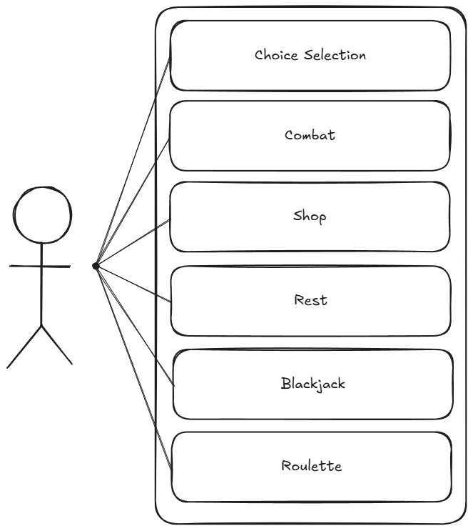
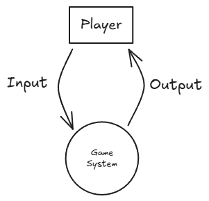
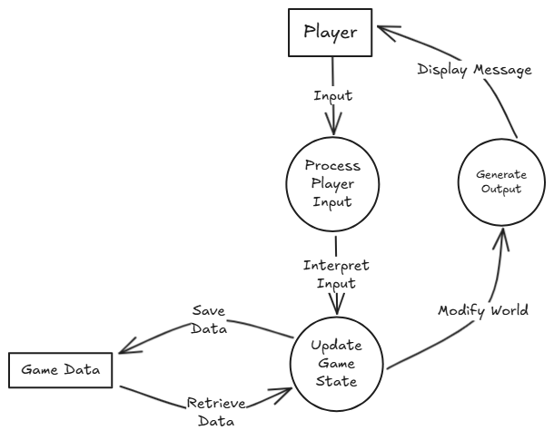
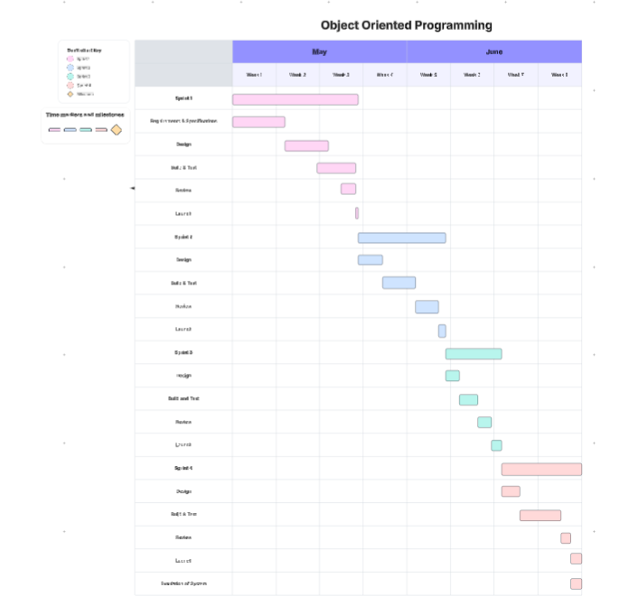

# 11SE Task 2 - OOP - Text Based Adventure
#### *By Yyoung Du*

---
## **Sprint 1**
---
<br />

### Requirements Definition
---

<br />

**Functional Requirements**
* Data Retrieval
    * The user needs to be able to view text telling them what is happening with each action they do. 
    * The user needs to be able to view their own and opponents health, weapon equiped and armour during combat.

<br />

* User Interface
    * The user can interact with the system when prompted using 1, 2, 3 etc.
    * Accoding to the selected option, the user should be able to progress through the game in different ways depending on their choices

<br />

* Data Display
    * The user will need do know what is happening in accordence to their choices.
    * They will need to know during combat:
        * Player Health
        * Player Attack
        * Player Defence
        * Player Equipment (Weapon, Armour)
        * Enemy Health
        * Enemy Attack
        * Enemy Defence
        * Enemy Equipment (Weapon, Armour)
    * When an enemy is defeated, user should know the drops of said enemy. 
 
<br />

**Non-Functional Requirements**
* Performance
    * The system sould run smoothly with minumal lag and delays between user input and outputs.

<br />

* Reliability
    * The system should be reliable with no crashes, as it is a text based game. 
    * User errors such as misinputs should be handled easily, with the game just prompting them to try again.

<br />

* Usability and Accessiblility
   * The system should be easy to navigate and read. 
   * A requirements.txt will be in place with all the required pip installs. 

<br />

### Determining Specifications
--- 

<br />

**Functional Specifications**
* User Requirements
    * The user needs to be able to input numbers that the program reads and does the action linked to that number.

<br />

* Inputs & Outputs
    * The program needs to be able to accept all kinds of inputs.
    * If the input is part of the expected inputs (1, 2, 3 etc), then it will progress the story
    * If it is and unexpected input, such as letters, it will prompt the user to try again.

<br />

* Core Features
    * It will need to accept user inputs, and progress the story using the user inputs.
    * It will also have a combat system that displays the players stats such as health, attack, defence, equipment as well as the enemy's stats as well. 
    * It will be a turn based combat system

<br />

* User Interaction
    * The user will interact with the system through numbers that are linked to a action with will be displayed so the user knows what to chose
    * E.g: \
    1 - Enter the mysterious doorway \
    2 - Leave into the forest \
    Selection:

<br />

* Error Handling
    * The most common type of error will be user misinput (If a user inputs for example a letter.)
    * The program will prompt the user to try again until something matches with the available selection.

<br />

**Non-Functional Specifications**
* Performance
    * The program should output things relatively quickly due to it being a texted based game. 
    * Using loops, data structures and functions, the program can run more efficiently.

<br />

* Reliability
    * The only issue I can see is user misinput which can be fixed by prompting the user to try again.

<br />

* Useability and Accessibility
   * I might have the text output slower, in bits and not just all at once to make it easier to read and understand. 
   * There will be a skip button for inpatient people.

<br />

### Use Cases
--- 

<br />

**Actor** 
    
    User 

**Preconditions** 
    
    Installed Requirements.txt; Access to a keyboard; Has run/started the program

**Main Flow:** 

    Choice Selection 

    User is prompted with a choice that varies for each scenario. The user then enters a number that is linked to a choice that was displayed. The program then progresses the story based on the selected choice, each selected choice will result in a different outcome that will make the user's playthrough harder or easier.

<br />

    Combat

    ALL COMBAT WILL BE 1V1

    DETERMINING INITIATIVE
    It user selects choice that results in combat: A dice is rolled (1-10)  to determine initiative. If the rolls are the same, it is rerolled. 

    PRE-ACTION
    On the user's turn, they are first given the option to use a pre-action. This can be things like using potions such as healing or mana regen or applying buffs like strength or  resistance. 

    ACTION
    Then they are given the ability to use a action. Actions are attacks such as magic, melee or ranged. This repeats until either the user or the opponent dies. 
    The opponent follows the same order of action with specific coded actions in relation to the situation. e.g They will use a healing potion if they are below 20% hp.

**Alternative Flows**

    Town / Village 

<br />

    CHECKPOINT
    At every town or village will be a checkpoint. It the user were to die, they would return to the last checkpoint with 20% health and 1/2 of their coin. They will loose all their items such as armour and sword. 
    The player will be 3 choice. 

<br />

    CHOICES
    They can leave the VILLAGE, enter the SHOP, REST or enter the CASINO.  

<br />

    SHOP
    The shop will have a variety of items such as potions, weapons, and grimoires (Allows you to learn spells, cast at the cost of mana. Can be regen with mana regen potions). Potions will have different tiers. If the player chooses 

<br />

    REST
    The player can pay some money (Determined by the users health) to rest and fully recover their health

<br />

    CASINO
    In the casino, the player can play: roulette or blackjack. 

<br />

    ROULETTE
    The player can choose a colour (Black or Red) / number (1 - 36). Then they will enter in the amount they want to bet. Picking a number and winning will multiply your money by 35 times . A colour will be doubleing your money. (Roulette wheel  may or may not be rigged. Win chance with RED/BLACK is 1/3 and win chance with numbers 1-36 is never.)

<br />

    BLACKJACK
    First, place your bets. You will be given 2 cards. You will also see one of the dealers cards. You can hit or stand. By hitting, you will be given another card, where you are allowed to pick hit/stand again. After both players (User and Dealer) have chosen stand, the winner will be calculated with the person who has the highers number of cards that done exceed 21. If the user gets 21, they win by default. By standing, the "Dealer" will show his cards. If it is 17 or higher, the dealer will stand. Otherwise, they will continue to hit until they get to 17 or higher. 

**Postconditions**

    CHOICE SELECTION
    After choice selection (where the user picks what path they want to choose), the system will progress the game, based on their selected choice and they can lead to different paths based on their choices.

<br />

    COMBAT
    After combat is finished, the user will be able to view drops from the dead opponent. Then they will be given CHOICE SELECTION and be able to progress through the game

<br />

    REST
    After rest, the player is given CHOICES. They can go shop, exit the village or gamble.

<br />

    SHOP
    After purchasing, the player is given CHOICES. They can go exit the village, rest or gamble

<br />

    GAMBLE
    After the user has lost all their money, they will be forcefully escorted out. They will be given the CHOICES to exit the village, rest or shop.

<br />

### Use Case Diagram
---


<br />

### Design
---

**Storyboards** 

As by program will be mostly text based, I will make the story board text based without using things like canva.

    MAIN STORY
    You have now entered the forest as you wander...

    You can: 
    1: .... 
    2: .... 
    3: .... 
    4: .... 

    Please Input Your Choice: 

<br />

    COMBAT
    YOU ARE THE FIRST TO MOVE

    What do you want to do?       
    ---------------------------------------
    Player 1
    Health❤️:[██████████](100/100)  
    Mana✨:[██████████](50/50)
    Attack🗡️: 12 
    Defence🛡️: 6
    ---------------------------------------
    Goblin
    Health❤️:[██████████](100/100)  
    Mana✨:[██████████](0/0)
    Attack🗡️: 6
    Defence🛡️: 1
    ----------------------------------------

    Choose your action:
    1. Attack 
    2. Cast Spell
    3. Use Item
    4. Attempt Escape

    Enter the number of your choice:
    

**Data Flow Diagram** \
*Level 0*

 

<br />

*Level 1*

 

**Gantt Chart**

 

### Build & Test
**main.py**
```
import pyfiglet #pip install pyfiglet
import UserInterface as UI
import Storyline as Storyline

# Player stats
player_name = "Hero"
player_type = "Warrior"
player_health = 18
player_max_health = 100
player_mana = 50
player_max_mana = 50
player_damage = 20
player_defence = 5


def main():
    UI.DisplayTitleScreen()
    UI.DisplaySeparator()
    print("=======================================")
    print("Player Stats")
    print("=======================================")
    print()
    UI.DisplayStats(player_name, player_type, player_health, player_max_health, player_mana, player_max_mana, player_damage, player_defence)
    input("Press Enter to continue...")
    Storyline.Storyline()


main()
```

**Storyline.py**
```
import UserInterface as UI

def Storyline():
    UI.DisplayScene("The Village of Eldoria", """You wake up to find your home burning in the sunlight and a loud roar in the distance. 
You run outside to see your whole village ravaged by fire and a large winged beast flying away. 
You try to find your family but your efforts are worthless as you find out from the town mayor. 
Your Mother and Sister were trapped under a burning pile of wood and were burnt. 
You ask the mayor about your father and the mayor lowers his head. 
In a weak voice he says your father couldn't deal with the news of your mother and sister and has run away leaving you and the rest of the town. 
More Buildings collapse as you stand there sobbing but action for your survival must be done. 
Rocks are falling around you.""", 
    {
        "Run to the forest": choice1,
        "Climb a tree": choice2,
        "Hide in a cave": choice3
    })
    
def choice1():
    UI.DisplayScene("The Forest", """You run into the forest and find a small cave.
You hide in the cave and wait for the danger to pass.
After a while, you hear the sound of footsteps approaching.
You hold your breath and try to stay quiet.
Suddenly, a group of bandits enters the cave.
They look around and spot you hiding in the corner.
They draw their weapons and approach you.""", exit)
    
def choice2():
    UI.DisplayScene("The Tree", """You climb up the tree and find a branch to sit on.
You look around and see the village burning below you.
You see the dragon flying away in the distance.
You take a deep breath and try to calm down.
Suddenly, you hear a loud crack.
The branch you are sitting on is breaking!""", exit)
    
def choice3():
    UI.DisplayScene("The Cave", """You hide in the cave and wait for the danger to pass.
You hear the sound of footsteps approaching.
You hold your breath and try to stay quiet.
Suddenly, a group of bandits enters the cave.
They look around and spot you hiding in the corner.
They draw their weapons and approach you.
You have to think fast!""", exit)
```

**UserInterface.py**
```
import pyfiglet

def DisplayTitleScreen():
    print(pyfiglet.figlet_format("Beyond the Horizon"))

def DisplaySeparator():
    print("+"+"-"*78+"+")

def DisplayTitle(title):
    DisplaySeparator()
    print(f"| {title:76} |")
    DisplaySeparator()

def DisplaySubTitle(title):
    print(f"| {title:76} |")
    DisplaySeparator()

def SelectAction(actions):
    while(True):
        DisplaySeparator()
        index=1
        options=list(actions.keys())
        for option in options:
            print(index,"-",option)
            index+=1
        try:
            option_index = int(input("Selection: "))
            print("You have selected:#", option_index)
            DisplaySeparator()
            action=options[option_index-1]
            print("You have selected:", action)
            actions[action]()
            return
        except:

            exit()

def DisplayDialog(title, description):
    DisplayTitle(title)
    print(description)

def DisplayScene(title, story, actions):
    DisplayDialog(title, story)
    selection=SelectAction(actions)

def DisplaySceneWithEvent(title, pre_description, event, post_description, actions):
    DisplayDialog(title,pre_description)
    event()
    DisplayDialog(title,post_description)
    selection=SelectAction(actions)

def DisplayStats(name, type, health, max_health, mana, max_mana, damage, defence):
    print(f"| Name: {name} |")
    print(f"| Type: {type} |")
    bar_count=int(health*10/max_health)
    bars="█"*bar_count
    dashes="█"*(10-bar_count)
    print(f"| Health❤️ : [\033[31m{bars}█\033[0m{dashes}]({health}/{max_health})|")
    bar_count=int(mana*10/max_mana)
    bars="█"*bar_count
    dashes="█"*(10-bar_count)
    print(f"| Mana✨ : [\033[94m{bars}█\033[0m{dashes}]({mana}/{max_mana})|")
    print(f"| Damage🗡️ : {damage} |")
    print(f"| Defence🛡️ : {defence} |")
    print("=======================================")

def DisplayInventory(inventory):
    print("=======================================")
    print("Inventory")
    print("=======================================")
    for item in inventory:
        print(f"| {item} |")
    print("=======================================")

def DisplayGameOver():
    print("=======================================")
    print("Game Over")
    print("=======================================")
    print("You have died. Please restart the game.")
    print("=======================================")
    print("Thank you for playing Beyond the Horizon!")
    print("=======================================")

```

