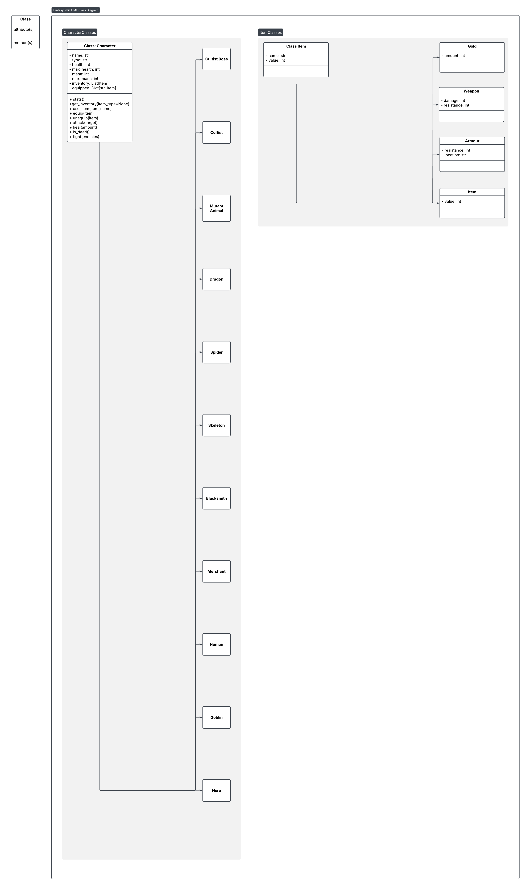

# 11SE Task 2 - OOP - Text Based Adventure
#### *By Yyoung Du*

---

## Sprint 1
---
<br />

### Requirements Definition
---

<br />

**Functional Requirements**
* Data Retrieval
    * The user needs to be able to view text telling them what is happening with each action they do. 
    * The user needs to be able to view their own and opponents health, weapon equiped and armour during combat.

<br />

* User Interface
    * The user can interact with the system when prompted using 1, 2, 3 etc.
    * Accoding to the selected option, the user should be able to progress through the game in different ways depending on their choices

<br />

* Data Display
    * The user will need do know what is happening in accordence to their choices.
    * They will need to know during combat:
        * Player Health
        * Player Attack
        * Player Defence
        * Player Equipment (Weapon, Armour)
        * Enemy Health
        * Enemy Attack
        * Enemy Defence
        * Enemy Equipment (Weapon, Armour)
    * When an enemy is defeated, user should know the drops of said enemy. 
 
<br />

**Non-Functional Requirements**
* Performance
    * The system sould run smoothly with minumal lag and delays between user input and outputs.

<br />

* Reliability
    * The system should be reliable with no crashes, as it is a text based game. 
    * User errors such as misinputs should be handled easily, with the game just prompting them to try again.

<br />

* Usability and Accessiblility
   * The system should be easy to navigate and read. 
   * A requirements.txt will be in place with all the required pip installs. 

<br />

### Determining Specifications
--- 

<br />

**Functional Specifications**
* User Requirements
    * The user needs to be able to input numbers that the program reads and does the action linked to that number.

<br />

* Inputs & Outputs
    * The program needs to be able to accept all kinds of inputs.
    * If the input is part of the expected inputs (1, 2, 3 etc), then it will progress the story
    * If it is and unexpected input, such as letters, it will prompt the user to try again.

<br />

* Core Features
    * It will need to accept user inputs, and progress the story using the user inputs.
    * It will also have a combat system that displays the players stats such as health, attack, defence, equipment as well as the enemy's stats as well. 
    * It will be a turn based combat system

<br />

* User Interaction
    * The user will interact with the system through numbers that are linked to a action with will be displayed so the user knows what to chose
    * E.g: \
    1 - Enter the mysterious doorway \
    2 - Leave into the forest \
    Selection:

<br />

* Error Handling
    * The most common type of error will be user misinput (If a user inputs for example a letter.)
    * The program will prompt the user to try again until something matches with the available selection.

<br />

**Non-Functional Specifications**
* Performance
    * The program should output things relatively quickly due to it being a texted based game. 
    * Using loops, data structures and functions, the program can run more efficiently.

<br />

* Reliability
    * The only issue I can see is user misinput which can be fixed by prompting the user to try again.

<br />

* Useability and Accessibility
   * I might have the text output slower, in bits and not just all at once to make it easier to read and understand. 
   * There will be a skip button for inpatient people.

<br />

### Use Cases
--- 

<br />

**Actor** 
    
    User 

**Preconditions** 
    
    Installed Requirements.txt; Access to a keyboard; Has run/started the program

**Main Flow:** 

    Choice Selection 

    User is prompted with a choice that varies for each scenario. The user then enters a number that is linked to a choice that was displayed. The program then progresses the story based on the selected choice, each selected choice will result in a different outcome that will make the user's playthrough harder or easier.

<br />

    Combat

    ALL COMBAT WILL BE 1V1

    DETERMINING INITIATIVE
    It user selects choice that results in combat: A dice is rolled (1-10)  to determine initiative. If the rolls are the same, it is rerolled. 

    PRE-ACTION
    On the user's turn, they are first given the option to use a pre-action. This can be things like using potions such as healing or mana regen or applying buffs like strength or  resistance. 

    ACTION
    Then they are given the ability to use a action. Actions are attacks such as magic, melee or ranged. This repeats until either the user or the opponent dies. 
    The opponent follows the same order of action with specific coded actions in relation to the situation. e.g They will use a healing potion if they are below 20% hp.

**Alternative Flows**

    Town / Village 

<br />

    CHOICES
    They can leave the VILLAGE, enter the SHOP, REST or enter the CASINO.  

<br />

    SHOP
    The shop will have a variety of items such as potions, weapons, and grimoires (Allows you to learn spells, cast at the cost of mana. Can be regen with mana regen potions). Potions will have different tiers. If the player chooses 

<br />

    REST
    The player can pay some money (Determined by the users health) to rest and fully recover their health

<br />

    CASINO
    In the casino, the player can play: roulette or blackjack. 

<br />

    ROULETTE
    The player can choose a colour (Black or Red) / number (1 - 36). Then they will enter in the amount they want to bet. Picking a number and winning will multiply your money by 35 times . A colour will be doubleing your money. (Roulette wheel  may or may not be rigged. Win chance with RED/BLACK is 1/3 and win chance with numbers 1-36 is never.)

<br />

    BLACKJACK
    First, place your bets. You will be given 2 cards. You will also see one of the dealers cards. You can hit or stand. By hitting, you will be given another card, where you are allowed to pick hit/stand again. After both players (User and Dealer) have chosen stand, the winner will be calculated with the person who has the highers number of cards that done exceed 21. If the user gets 21, they win by default. By standing, the "Dealer" will show his cards. If it is 17 or higher, the dealer will stand. Otherwise, they will continue to hit until they get to 17 or higher. 

**Postconditions**

    CHOICE SELECTION
    After choice selection (where the user picks what path they want to choose), the system will progress the game, based on their selected choice and they can lead to different paths based on their choices.

<br />

    COMBAT
    After combat is finished, the user will be able to view drops from the dead opponent. Then they will be given CHOICE SELECTION and be able to progress through the game

<br />

    REST
    After rest, the player is given CHOICES. They can go shop, exit the village or gamble.

<br />

    SHOP
    After purchasing, the player is given CHOICES. They can go exit the village, rest or gamble

<br />

    GAMBLE
    After the user has lost all their money, they will be forcefully escorted out. They will be given the CHOICES to exit the village, rest or shop.

<br />

### Use Case Diagram
---


<br />

### Design
---

**Storyboards** 

As by program will be mostly text based, I will make the story board text based without using things like canva.

    MAIN STORY
    You have now entered the forest as you wander...

    You can: 
    1: .... 
    2: .... 
    3: .... 
    4: .... 

    Please Input Your Choice: 

<br />

    COMBAT
    YOU ARE THE FIRST TO MOVE

    What do you want to do?       
    ---------------------------------------
    Player 1
    Health❤️:[██████████](100/100)  
    Mana✨:[██████████](50/50)
    Attack🗡️: 12 
    Defence🛡️: 6
    ---------------------------------------
    Goblin
    Health❤️:[██████████](100/100)  
    Mana✨:[██████████](0/0)
    Attack🗡️: 6
    Defence🛡️: 1
    ----------------------------------------

    Choose your action:
    1. Attack 
    2. Cast Spell
    3. Use Item
    4. Attempt Escape

    Enter the number of your choice:
    

**Data Flow Diagram** \
*Level 0*

 

<br />

*Level 1*

 

**Gantt Chart**

 

### Build & Test
---

**main.py**
```
import UserInterface as UI
import Storyline as Storyline

# Player stats
player_name = "Hero"
player_type = "Warrior"
player_health = 18
player_max_health = 100
player_mana = 50
player_max_mana = 50
player_damage = 20
player_defence = 5


def main():
    UI.DisplayTitleScreen()
    UI.DisplaySeparator()
    print("=======================================")
    print("Player Stats")
    print("=======================================")
    print()
    UI.DisplayStats(player_name, player_type, player_health, player_max_health, player_mana, player_max_mana, player_damage, player_defence)
    input("Press Enter to continue...")
    Storyline.Storyline()


main()    
```

<br />

**Storyline.py**
```
import UserInterface as UI

def Storyline():
    UI.DisplayScene("The Village of Eldoria", """You wake up to find your home burning in the sunlight and a loud roar in the distance. 
You run outside to see your whole village ravaged by fire and a large winged beast flying away. 
You try to find your family but your efforts are worthless as you find out from the town mayor. 
Your Mother and Sister were trapped under a burning pile of wood and were burnt. 
You ask the mayor about your father and the mayor lowers his head. 
In a weak voice he says your father couldn't deal with the news of your mother and sister and has run away leaving you and the rest of the town. 
More Buildings collapse as you stand there sobbing but action for your survival must be done. 
Rocks are falling around you.""", 
    {
        "Run to the forest": choice1,
        "Climb a tree": choice2,
        "Hide in a cave": choice3
    })
    
def choice1():
    UI.DisplayScene("The Forest", """You run into the forest and find a small cave.
You hide in the cave and wait for the danger to pass.
After a while, you hear the sound of footsteps approaching.
You hold your breath and try to stay quiet.
Suddenly, a group of bandits enters the cave.
They look around and spot you hiding in the corner.
They draw their weapons and approach you.""", exit)
    
def choice2():
    UI.DisplayScene("The Tree", """You climb up the tree and find a branch to sit on.
You look around and see the village burning below you.
You see the dragon flying away in the distance.
You take a deep breath and try to calm down.
Suddenly, you hear a loud crack.
The branch you are sitting on is breaking!""", exit)
    
def choice3():
    UI.DisplayScene("The Cave", """You hide in the cave and wait for the danger to pass.
You hear the sound of footsteps approaching.
You hold your breath and try to stay quiet.
Suddenly, a group of bandits enters the cave.
They look around and spot you hiding in the corner.
They draw their weapons and approach you.
You have to think fast!""", exit)

```

<br />

**UserInterface.py**
```
import pyfiglet

def DisplayTitleScreen():
    print(pyfiglet.figlet_format("Beyond the Horizon"))

def DisplaySeparator():
    print("+"+"-"*78+"+")

def DisplayTitle(title):
    DisplaySeparator()
    print(f"| {title:76} |")
    DisplaySeparator()

def DisplaySubTitle(title):
    print(f"| {title:76} |")
    DisplaySeparator()

def SelectAction(actions):
    while(True):
        DisplaySeparator()
        index=1
        if isinstance(actions, dict):
            options = list(actions.keys())

        elif isinstance(actions, list):
            options = actions

        else:
            return
        
        for option in options:
            print(index,"-",option)
            index+=1

        try:
            option_input = input("Selection: ")
            option_index = int(option_input)
            if option_index < 1 or option_index > len(options):
                print("Invalid selection. Please enter a number between 1 and", len(options))
                continue
            print("You have selected:#", option_index)
            DisplaySeparator()
            action=options[option_index-1]
            print("You have selected:", action)
            actions[action]()
            return
        
        except ValueError:
            print("Invalid input. Please enter a valid number.")
            exit()

def DisplayDialog(title, description):
    DisplayTitle(title)
    print(description)

def DisplayScene(title, story, actions):
    DisplayDialog(title, story)
    selection=SelectAction(actions)

def DisplaySceneWithEvent(title, pre_description, event, post_description, actions):
    DisplayDialog(title,pre_description)
    event()
    DisplayDialog(title,post_description)
    selection=SelectAction(actions)

def DisplayStats(name, type, health, max_health, mana, max_mana, damage, defence):
    print(f"| Name: {name} |")
    print(f"| Type: {type} |")
    if health > max_health:
        bonus_health = health - max_health
        health = max_health
    else:
        bonus_health = 0

    bar_count = int(health * 10 / max_health)
    bars = "█" * bar_count
    dashes = "█" * (10 - bar_count)
    health_bar = f"\033[31m{bars}\033[0m{dashes}"

    if bonus_health > 0:
        bonus_bar_count = int(bonus_health * 10 / max_health)
        bonus_bars = "\033[33m" + "█" * bonus_bar_count + "\033[0m"
        health_bar += bonus_bars
        print(f"| Health❤️ : [{health_bar}]({health + bonus_health}/{max_health})|")
    else:
        print(f"| Health❤️ : [{health_bar}]({health}/{max_health})|")

    if mana > max_mana:
        bonus_mana = mana - max_mana
        mana = max_mana
    else:
        bonus_mana = 0

    bar_count = int(mana * 10 / max_mana)
    bars = "█" * bar_count
    dashes = "█" * (10 - bar_count)
    mana_bar = f"\033[94m{bars}\033[0m{dashes}"

    if bonus_mana > 0:
        bonus_bar_count = int(bonus_mana * 10 / max_mana)
        bonus_bars = "\033[96m" + "█" * bonus_bar_count + "\033[0m"
        mana_bar += bonus_bars
        print(f"| Mana✨ : [{mana_bar}]({mana + bonus_mana}/{max_mana})|")
    else:
        print(f"| Mana✨ : [{mana_bar}]({mana}/{max_mana})|")
        
    print(f"| Damage🗡️ : {damage} |")
    print(f"| Defence🛡️ : {defence} |")
    print("=======================================")

def DisplayInventory(inventory):
    print("=======================================")
    print("Inventory")
    print("=======================================")
    for item in inventory:
        print(f"| {item} |")
    print("=======================================")

def DisplayGameOver():
    print("=======================================")
    print("Game Over")
    print("=======================================")
    print("You have died. Please restart the game.")
    print("=======================================")
    print("Thank you for playing Beyond the Horizon!")
    print("=======================================")

```

### Review
---
The prototype for sprint 1 is able to many of the things specified in me functional and non-functional requirements. The user is able to view text telling them what is happening as well as be able to view their stats. Inventory and combat is still needed to be implemented. The system is able to prompt users using 1, 2, 3 etc. The user is also able to select an option, which brings them a different area of the game. The user is also able to know what happened in accordence to their choices. *Combat is still yet to be implemented*. The system is also able to run smoothly with no lag at all. The system is able to handle errors such as misinputs. It is also easy to read.

The user is prompted with a choice for each scenario. Each scenario will bring the user to a different location. Other parts of the use case has not been implemented. 

I believe the current program is well organised with each action defined into different functions.

I will need to add inventory, as well as implement a basic combat system. The code quality is pretty good and I can not think of ways I can majorly improve on it.

<br />

### Launch
---

**README.md**

    PROJECT Beyond the Horizon

    Overview

    Follow the instructions below to set up and run the software.

    Prerequisites

    - Python 3.10 or higher installed
    - Git (optional, for cloning the repository)

    Setup Instructions

    1. Install Dependencies
        In a new terminal (Control + Shift + `) paste in:

        "pip install -r requirements.txt"

    2. Run the Program

        
        "main.py"

    Notes

    - Ensure all required files are in the same directory.

**requirements.txt**

    pyfiglet


## Sprint 2
---
<br />

### Design
---

**Structure Chart** \


<br />

**Algorithms (Flowchart)**

<br />

*Mainline routine* \


*Subroutine: DisplayTitleScreen* \


*Subroutine: DisplayStats* \


<br />

**Algorithms (Pseudocode)**

<br />

*Mainline Routine*
```
START
    player_name = "Player1
    player_type = "Warrior"
    player_health = 100
    player_max_health = 100
    player_mana = 50
    player_max_mana = 50
    player_damage = 
    player_defence = 5

    DisplayTitleScreen(player_name, player_type, player_health, player_max_health, player_mana, player_max_mana, player_damage, player_defence)
    DisplayStats()
    Storyline()
END
```

*Subroutine: DisplayTitleScreen*
```
BEGIN DisplayTitleScreen()
    DISPLAY Beyond The Horizon
END DisplayTitleScreen()
```

*Subroutine: Storyline*
```
BEGIN Storyline
    DisplayScene(title, story, action)
END Storyline
```

*Subroutine: DisplayScene*
```
BEGIN DisplayScene(title, story, actions)
    DisplayDialoge(title, story)
    SelectAction(actions)    
END DisplayScene
```

*Subroutine: DisplayStats*
```
BEGIN DisplayStats(name, type, health, max_health, mana, max_mana, damage, defence)
    DISPLAY name
    DISPLAY type

    IF health > max_health THEN
        bonus_health = health - max_health
        health = max_health
    ELSE
        bonus_health = 0
    ENDIF

    bar_count = (health * 10) / max_health
    active_health = █ * bar_count
    inactive_health = █ * (10 - bar_count)
    health_bar =  active_health, inactive_health
    DISPLAY health_bar

    IF mana > max_mana THEN
        bonus_mana = mana - max_mana
        mana = max_mana
    ELSE
        bonus_mana = 0
    ENDIF

    bar_count = (mana * 10) / max_mana
    bars = █ * bar_count
    dashes = █ * (10 - bar_count)
    mana_bar = bars, dashes
    DISPLAY mana_bar

    DISPLAY damage
    DISPLAY defence
END DisplayStats
```

---

### Build and Test
**main.py**
```
import UserInterface as UI
import Storyline as Storyline
import CombatSystem as Combat

Combat.HeroName

def main():
    UI.DisplayTitleScreen()
    UI.DisplaySeparator()
    input("Press Enter to continue...")
    Storyline.Storyline()

main()     
```

**CombatSystem.py**
```
import UserInterface as UI
import random

# Ask the player for their hero's name
HeroName = input("Enter your name: ")

def select_dialog(prompt,items):
    """
    Display a selection dialog for the user to choose an item from a list.
    """
    while(True):
        index=1
        UI.DisplayTitle(prompt)
        for item in items:
            if isinstance(item,Item):
                print(f"{index:2} - {item.name:20} {item.value:5} 🪙")
            else:
                print(f"{index:2} - {item.name:20}")
            index+=1
        try:
            item_index = int(input("Selection: "))
            item=items[item_index-1]
            print("You have selected:", item.name)
            return item
        except:
            print("Stop being an idiot!!!")
            continue

def roll_dice(prompt, sides):
    """
    Simulate rolling a dice with a given number of sides.
    """
    result = random.randrange(1,sides)
    print(f"{prompt}: {result}")
    return result

# Base class for all items
class Item(object):
    def __init__(self,name,value):
        self.name=name
        self.value=value

# Healing item class
class Healing(Item):
    def __init__(self,name,value,amount):
        super().__init__(name,value)
        self.amount=amount

# Gold item class
class Gold(Item):
    def __init__(self,value):
        super().__init__("Bag of Gold",value)
        self.value=value

# Weapon item class
class Weapon(Item):
    def __init__(self,name,value,damage):
        super().__init__(name,value)
        self.resistance=0
        self.damage=damage

# Armour item class
class Armour(Item):
    def __init__(self,name,value,resistance,location):
        super().__init__(name,value)
        self.resistance=resistance
        self.location=location

# Base class for all characters
class Character(object):
    def __init__(self,name,type,health,max_mana=0):
        # Equipped items: Head, Torso, Legs, Weapon
        self.equipped={
            'Head': Armour("Nothing",0,0,"Head"),
            'Torso': Armour("Nothing",0,0,"Torso"),
            'Legs': Armour("Nothing",0,0,"Legs"),
            'Weapon' : Weapon("Nothing",0,0)}
        self.name=name
        self.type=type
        self.health=health
        self.max_health=health
        self.inventory=[]
        self.max_mana = max_mana
        self.mana = max_mana

    def stats(self):
        """
        Display the character's stats.
        """
        UI.DisplayStats(self.name,self.type, self.health,self.max_health,self.mana,self.max_mana)

    def get_inventory(self, item_type=None):
        """
        Get the character's inventory, optionally filtered by item type.
        """
        if item_type is None:
            return self.inventory
        return [item for item in self.inventory if isinstance(item, item_type)]

    def get_inventory_armour(self):
        """
        Get all armour items in the inventory.
        """
        return self.get_inventory(Armour)
    
    def use_item(self, item_name):
        """
        Use an item from inventory by name. If it's a Healing item, apply healing.
        """
        for item in self.inventory:
            if item.name == item_name:
                if isinstance(item, Healing):
                    self.heal(item.amount)
                    print(f"{self.name} used {item.name} and healed for {item.amount} HP.")
                    self.stats()
                    self.remove(item.name)
                    return True
                else:
                    print(f"{item.name} cannot be used directly.")
                    return False
        print(f"{item_name} not found in inventory.")
        return False

    def equip(self,item):
        """
        Equip a weapon or armour, or use a healing item.
        """
        if isinstance(item,Weapon):
            self.equipped["Weapon"]=item
        elif isinstance(item,Armour):
            self.equipped[item.location]=item
        elif isinstance(item,Healing):
            self.heal(item.amount)
            self.remove(item.name)

    def unequip(self,item):
        """
        Unequip an item from the equipped slots.
        """
        for location in self.equipped.keys():
            if item==self.equipped[location]:
                if isinstance(item,Weapon):
                    self.equipped[location]=Weapon("Nothing",0,0)
                elif isinstance(item,Armour):
                    self.equipped[location]=Armour("Nothing",0,0,location)

    def get_gold(self):
        """
        Get the gold item from inventory, or create one if not present.
        """
        for destination_item in self.inventory:
            if isinstance(destination_item,Gold):
                return destination_item
        destination_item=Gold(0)
        self.inventory.append(destination_item)
        return destination_item

    def add_gold(self,source_item):
        """
        Add gold from another item to this character's gold.
        """
        gold=self.get_gold()
        gold.value+=source_item.value

    def give(self,item):
        """
        Give an item to the character (add to inventory).
        """
        if isinstance(item,Gold):
            self.add_gold(item)
        else:
            self.inventory.append(item)
        
    def remove(self,target_item_name):
        """
        Remove an item from inventory by name.
        """
        for inventory_item in self.inventory:
            if target_item_name == inventory_item.name:
                self.unequip(inventory_item)
                self.inventory.remove(inventory_item)
                return

    def give_and_equip(self,item):
        """
        Give an item and equip it immediately.
        """
        self.give(item)
        self.equip(item)

    def show_equiped(self):
        """
        Display currently equipped items.
        """
        UI.DisplayTitle("Equiped items")
        for location in self.equipped.keys():
            print(f"{location:10}:",self.equipped[location].name)

    def equip_dialog(self):
        """
        Dialog for equipping items from inventory.
        """
        while True:
            response = input("Do you want to equip an item?(Yes / No) ")
            if response == 'Yes' or response == 'yes':
                self.equip(select_dialog("Equip item",self.inventory))
                self.show_equiped()
            else:
                return

    def show_item_list(self,title,list):
        """
        Display a list of items with a title.
        """
        UI.DisplayTitle(title)
        index=1
        for item in list:
            print(f"{index:2} - {item.name:20} {item.value:5} 🪙")
            index+=1

    def get_total_resistance(self):
        """
        Calculate total resistance from equipped armour.
        """
        resistance=0
        for location in self.equipped.keys():
            resistance=resistance+self.equipped[location].resistance
        return resistance
        
    def attack(self,target):
        """
        Attack a target character, considering weapon damage and target's resistance.
        """
        sides=6
        attack_damage = int((self.equipped["Weapon"].damage*roll_dice("\tAttacking",sides))/sides)
        resistance=target.get_total_resistance()
        armoured_attack_damage=attack_damage-resistance
        if armoured_attack_damage<0:
            armoured_attack_damage=0           
        target.health-=armoured_attack_damage

    def heal(self,amount):
        """
        Heal the character by a certain amount, up to max health.
        """
        self.health = self.health + amount
        if self.health > self.max_health:
            self.health=self.max_health

    def is_dead(self):
        """
        Check if the character is dead.
        """
        if self.health<=0:
            return True
        return False

    def sell(self,target):
        """
        Sell an item to another character.
        """
        item=select_dialog(f"{self.name} selling to {target.name}",self.inventory)
        if isinstance(item,Gold):
            return
        target_gold=target.get_gold()
        self_gold=self.get_gold()
        if target_gold.value>=item.value:
            print(f"{self.name} sold the the {item.name} to {target.name} for {item.value} gold")
            target.give(item)
            self.remove(item.name)
            target_gold.value-=item.value
            self_gold.value+=item.value
        else:
            print(f"{target.name} does not have enough gold")

    def buy(self,target):
        """
        Buy an item from another character.
        """
        target.sell(self)

    def trade(self,target):
        """
        Trade items with another character.
        """
        while(True):
            self.DisplayInventory()
            target.DisplayInventory()
            UI.DisplayTitle(f"{self.name} is trading with {target.name}")
            index=1
            options=["Buy", "Sell","Stop Trading"]
            for option in options:
                print(f"{index:2} - {option:20}")
                index+=1
            try:
                option_index = int(input("Selection: "))
                option=options[option_index-1]
                print("You have selected:", option)
                if option=="Buy":
                    self.buy(target)
                elif option=="Sell":
                    self.sell(target)
                else:
                    return
            except:
                print("Stop being an idiot!!!")

    def fight(self,enemies):
        """
        Start a fight with a list of enemy characters.
        """
        UI.DisplayTitle("A fight has started")
        round=1
        while(True):
            UI.DisplayTitle(f"Round {round}")
            round+=1
            self.stats()
            #player attacks
            live_enemies=[]
            for enemy in enemies:
                if not enemy.is_dead():
                    enemy.stats()
                    live_enemies.append(enemy)

            if len(live_enemies)==0:
                print("YOU WIN!!!")
                return True
            self.equip_dialog()
            target=select_dialog("Who will you attack?",live_enemies)
            self.attack(target)
            for enemy in live_enemies:
                enemy.attack(self)
                if self.is_dead():
                    print("""
██╗░░░██╗░█████╗░██╗░░░██╗  ██████╗░██╗███████╗██████╗░
╚██╗░██╔╝██╔══██╗██║░░░██║  ██╔══██╗██║██╔════╝██╔══██╗
░╚████╔╝░██║░░██║██║░░░██║  ██║░░██║██║█████╗░░██║░░██║
░░╚██╔╝░░██║░░██║██║░░░██║  ██║░░██║██║██╔══╝░░██║░░██║
░░░██║░░░╚█████╔╝╚██████╔╝  ██████╔╝██║███████╗██████╔╝
░░░╚═╝░░░░╚════╝░░╚═════╝░  ╚═════╝░╚═╝╚══════╝╚═════╝░""")
                    exit(0)

# Hero character class
class Hero(Character):
    def __init__(self,name):
        super().__init__(name,"Human", 100, max_mana=50)
        self.give_and_equip(Weapon("Stick",0,random.randrange(5,15)))
        self.give(Gold(10))

# Goblin enemy class
class Goblin(Character):
    def __init__(self,name):
        super().__init__(name,"Goblin", random.randrange(40,50), max_mana=0)
        self.give_and_equip(Weapon("Club",1,random.randrange(5,10)))

# Human enemy class
class Human(Character):
    def __init__(self,name):
        super().__init__(name,"Human", 25, max_mana=0)
        self.give_and_equip(Weapon("Level 1 Wooden Sword",2,5))

# Merchant NPC class
class Merchant(Character):
    def __init__(self,name):
        super().__init__(name,"Merchant", random.randrange(50,55), max_mana=0)
        # Add multiple healing potions to inventory
        self.give(Healing("Lvl 1 Health Potion",5,10))
        self.give(Healing("Lvl 2 Health Potion",15,20))
        self.give(Healing("Lvl 3 Health Potion",25,30))
        self.give(Healing("Lvl 4 Health Potion",40,50))
        self.give(Healing("Lvl 5 Health Potion",70,100))
        self.give(Healing("Lvl 1 Health Potion",5,10))
        self.give(Healing("Lvl 2 Health Potion",15,20))
        self.give(Healing("Lvl 3 Health Potion",25,30))
        self.give(Healing("Lvl 4 Health Potion",40,50))
        self.give(Healing("Lvl 5 Health Potion",70,100))
        self.give(Healing("Lvl 1 Health Potion",5,10))
        self.give(Healing("Lvl 2 Health Potion",15,20))
        self.give(Healing("Lvl 3 Health Potion",25,30))
        self.give(Healing("Lvl 4 Health Potion",40,50))
        self.give(Healing("Lvl 5 Health Potion",70,100))
        self.give(Healing("Lvl 1 Health Potion",5,10))
        self.give(Healing("Lvl 2 Health Potion",15,20))
        self.give(Healing("Lvl 3 Health Potion",25,30))
        self.give(Healing("Lvl 4 Health Potion",40,50))
        self.give(Healing("Lvl 5 Health Potion",70,100))
        self.give(Gold(100))

# Blacksmith NPC class
class Blacksmith(Character):
    def __init__(self,name):
        super().__init__(name,"Blacksmith",random.randrange(50,55), max_mana=0)
        # Add various weapons and armour to inventory
        self.give(Weapon("Lvl 1 Wooden Sword",3, 5))
        self.give(Weapon("Lvl 2 Wooden Sword",6, 10))
        self.give(Weapon("Lvl 3 Wooden Sword",9, 15))

        self.give(Weapon("Lvl 1 Metal Sword",13, 20))
        self.give(Weapon("Lvl 2 Metal Sword",16, 25))
        self.give(Weapon("Lvl 3 Metal Sword",19, 30))

        self.give(Weapon("Lvl 1 Diamond Sword",23, 35))
        self.give(Weapon("Lvl 2 Diamond Sword",26, 40))
        self.give(Weapon("Lvl 3 Diamond Sword",29, 45))
        
        self.give(Armour("leather chestplate",5,2 ,'Torso'))
        self.give(Armour("leather helmet",2,1 ,'Head'))

        self.give(Armour("Metal chestplate",15,10 ,'Torso'))
        self.give(Armour("Metal helmet",12,7 ,'Head'))
        self.give(Gold(100))
        
# Skeleton enemy class
class Skeleton(Character):
    def __init__(self,name):
        super().__init__(name,"Skeleton", random.randrange(40,60), max_mana=0)
        self.give_and_equip(Weapon("Level 1 Wooden Bow",5,random.randrange(17,27)))

# Spider enemy class
class Spider(Character):
    def __init__(self,name):
        super().__init__(name,"Spider", random.randrange(40,60), max_mana=0)
        self.give_and_equip(Weapon("Fangs",0,random.randrange(15,27)))

# Dragon enemy class
class Dragon(Character):
    def __init__(self,name):
        super().__init__(name,"Dragon", 100, max_mana=0)
        self.give_and_equip(Weapon("Fire Breath",0,60))

# Mutant animal enemy class
class MutantAnimal(Character):
    def __init__(self,name):
        super().__init__(name,"MutantAnimal",random.randrange(40,60), max_mana=0)
        self.give_and_equip(Weapon("Bite",0,random.randrange(10,20)))

# Cultist enemy class
class Cultist(Character):
    def __init__(self,name):
        super().__init__(name,"Cultist",random.randrange(50,70), max_mana=0)
        self.give_and_equip(Weapon("Cult Hex",0,random.randrange(40,60)))

# Cultist boss enemy class
class CultistBoss(Character):
    def __init__(self, name):
        super().__init__(name, "Cultist", 150, max_mana=0)
        self.give_and_equip(Weapon("Magic Hands",0,100))

# Fight and loot event functions

def GoblinFight():
    """
    Fight a single goblin and receive loot.
    """
    Player.fight([Goblin("Brzt")])
    Player.give(Weapon("Club",1,random.randrange(5,10)))
    Player.give(Gold(5))

def BanditFight():
    """
    Fight two bandits and receive loot.
    """
    Player.fight([Human("Bob"),Human("Gary"),])
    Player.give(Weapon("Level 1 Wooden Sword",2,random.randrange(5,10)))
    Player.give(Weapon("Level 1 Wooden Sword",2,random.randrange(5,10)))
    Player.give(Weapon("Level 1 Wooden Sword",2,random.randrange(5,10)))
    Player.give(Gold(10))
    Player.give(Healing("Lvl 1 Health Potion",5,10))

def SkeletonFight():
    """
    Fight three skeletons and receive loot.
    """
    Player.fight([Skeleton("Norman"),Skeleton("Harry"),Skeleton("George")])
    Player.give(Weapon("Level 1 Wooden Bow",5,random.randrange(15,25)))
    Player.give(Weapon("Level 1 Wooden Bow",5,random.randrange(15,25)))
    Player.give(Weapon("Level 1 Wooden Bow",5,random.randrange(15,25)))
    Player.give(Gold(15))

def SpiderFight():
    """
    Fight three spiders and receive loot.
    """
    Player.fight([Spider("Spider"),Spider("Spider"),Spider("Spider")])
    Player.give(Healing("Lvl 1 Health Potion",5,10))
    Player.give(Healing("Lvl 1 Health Potion",5,10))
    Player.give(Gold(15))

def SpiderAndSkeletonFight():
    """
    Fight three skeletons and three spiders and receive loot.
    """
    Player.fight([Skeleton("Norman"),Skeleton("Harry"),Skeleton("George"),Spider("Spider"),Spider("Spider"),Spider("Spider")])
    Player.give(Healing("Lvl 1 Health Potion",5,10))
    Player.give(Healing("Lvl 1 Health Potion",5,10))
    Player.give(Weapon("Level 1 Wooden Bow",5,random.randrange(15,25)))
    Player.give(Weapon("Level 1 Wooden Bow",5,random.randrange(15,25)))
    Player.give(Weapon("Level 1 Wooden Bow",5,random.randrange(15,25)))
    Player.give(Gold(30))

def GoblinRoomFight():
    """
    Fight three goblins and receive loot.
    """
    Player.fight([Goblin("Klink"),Goblin("Kaaduk"),Goblin("Ebalk")])
    Player.give(Weapon("Club",1,random.randrange(5,10)))
    Player.give(Weapon("Club",1,random.randrange(5,10)))
    Player.give(Weapon("Club",1,random.randrange(5,10)))
    Player.give(Gold(25))

def LootRoom():
    """
    Receive loot from a loot room.
    """
    Player.give(Gold(50))
    Player.give(Weapon("Lvl 3 Metal Sword",19,30))

def DragonFight():
    """
    Fight a dragon and receive loot.
    """
    Player.fight([Dragon("Toothless")])
    Player.give(Weapon("Lvl 2 Diamond Sword",26,40))
    Player.give(Healing("Lvl 3 Health Potion",25,30))
    Player.give(Healing("Lvl 4 Health Potion",40,50))
    Player.give(Healing("Lvl 3 Health Potion",25,30))
    Player.give(Healing("Lvl 4 Health Potion",40,50))
    Player.give(Gold(100))

def MutantAnimalFight():
    """
    Fight five mutant animals and receive loot.
    """
    Player.fight([MutantAnimal("Mutated Animal"),MutantAnimal("Mutated Animal"),MutantAnimal("Mutated Animal"),MutantAnimal("Mutated Animal"),MutantAnimal("Mutated Animal")])
    Player.give(Gold(15))

def Cultistfight():
    """
    Fight three cultists and receive loot.
    """
    Player.fight([Cultist("Perfaren"),Cultist("Tratoris"),Cultist("Ianxalim")])
    Player.give(Healing("Lvl 2 Health Potion",15,20))
    Player.give(Healing("Lvl 2 Health Potion",15,20))
    Player.give(Healing("Lvl 3 Health Potion",25,30))
    Player.give(Weapon("Lvl 1 Mithril Sword",30, 50))

def CultistFinalBoss():
    """
    Fight the cultist boss.
    """
    Player.fight([CultistBoss("Scolrang")])

# Create main player and NPCs
Player = Hero(HeroName)
blacksmith_bob=Blacksmith("Blacksmith Bob")
Merchant_Charlie=Merchant("Merchant Charlie")
Merchant_Barlie=Merchant("Merchant Barlie")
```

**Storyline.py**
```import UserInterface as UI
import CombatSystem as Combat

# Main storyline function
def Storyline():
    # Display the title of the scene
    UI.DisplayTitle("The Burning Village")
    # Print the opening narrative
    print("""You wake up to find your home burning in the sunlight and a loud roar in the distance. 
You run outside to see your whole village ravaged by fire and a large winged beast flying away. 
You try to find your family but your efforts are worthless as you find out from the town mayor. 
Your Mother and Sister were trapped under a burning pile of wood and were burnt. 
You ask the mayor about your father and the mayor lowers his head. 
In a weak voice he says your father couldn't deal with the news of your mother and sister and has run away leaving you and the rest of the town. 
More Buildings collapse as you stand there sobbing but action for your survival must be done. 
Rocks are falling around you.""")
    # Define possible actions for the player
    actions = {
        "Run to the forest": Run_to_Forest,
        "Climb a tree": Climb_Tree,
        "Hide in a cave": Hide_Cave,
        "Check Inventory": lambda: None
    }
    # Let the player select an action
    selected = UI.SelectAction(actions)
    # If player checks inventory, show inventory and return to this scene
    if selected == "Check Inventory":
        Access_Inventory()
        Storyline()

# Action: Run to the forest
def Run_to_Forest():
    UI.DisplaySubTitle("Run to the Forest")
    print("""You run into the forest and find a small cave.
You hide in the cave and wait for the danger to pass.
After a while, you hear the sound of footsteps approaching.
You hold your breath and try to stay quiet.
Suddenly, a group of bandits enters the cave.
They look around and spot you hiding in the corner.
They draw their weapons and approach you.""")
    # Define actions in this scenario
    actions = {
        "Stand up and fight": BanditAttack,
        "Try to run away": lambda: (print("You try to run away, but the bandits catch you!"), UI.DisplayGameOver()),
        "Check Inventory": lambda: None
    }
    selected = UI.SelectAction(actions)
    # If player checks inventory, show inventory and return to this scene
    if selected == "Check Inventory":
        Access_Inventory()
        Run_to_Forest()

# Action: Climb a tree
def Climb_Tree():
    UI.DisplaySubTitle("Climb Tree")
    print("""You climb up the tree and find a branch to sit on.
You look around and see the village burning below you.
You see the dragon flying away in the distance.
You take a deep breath and try to calm down.
Suddenly, you hear a loud crack.
The branch you are sitting on is breaking!""")
    # Define actions in this scenario
    actions = {
        "Jump down quickly": lambda: print("You jump down and land safely, but you are shaken."),
        "Hold on tight": lambda: print("You hold on, but the branch snaps and you fall!"),
        "Check Inventory": lambda: None
    }
    selected = UI.SelectAction(actions)
    # If player checks inventory, show inventory and return to this scene
    if selected == "Check Inventory":
        Access_Inventory()
        Climb_Tree()

# Action: Hide in a cave
def Hide_Cave():
    UI.DisplaySubTitle("Hide in Cave")
    print("""You hide in the cave and wait for the danger to pass.
You hear the sound of footsteps approaching.
You hold your breath and try to stay quiet.
Suddenly, a group of bandits enters the cave.
They look around and spot you hiding in the corner.
They draw their weapons and approach you.
You have to think fast!""")
    # Define actions in this scenario
    actions = {
        "Fight the bandits": BanditAttack,
        "Try to sneak past": lambda: (print("You try to sneak past, but they notice you!"), UI.DisplayGameOver()),
        "Check Inventory": lambda: None
    }
    selected = UI.SelectAction(actions)
    # If player checks inventory, show inventory and return to this scene
    if selected == "Check Inventory":
        Access_Inventory()
        Hide_Cave()

# Handles the bandit attack scenario
def BanditAttack():
    # Start the combat with bandits
    Combat.BanditFight()

    # Display the aftermath scene
    UI.DisplayScene("Bandit Attack",
                    """You survive the bandit attack, but you are injured.
You manage to escape the cave and find yourself back in the forest.
""",
                    {
                        "Continue deeper into the forest": exit
                    })

# Allows the player to access and use items from their inventory
def Access_Inventory():
    inventory = Combat.Player.get_inventory()
    if not inventory:
        print("Your inventory is empty.")
        return
    # Create actions for each item in inventory
    item_actions = {item.name: (lambda name=item.name: Use_Item(name)) for item in inventory}
    item_actions["Exit Inventory"] = lambda: None
    # Display inventory scene
    UI.DisplayScene("Inventory", "Select an item to use or exit:", item_actions)
    return

# Handles using an item from the inventory
def Use_Item(item_name):
    result = Combat.Player.use_item(item_name)  # Use the Player instance
    if result:
        print()
        input("Press Enter to continue...")
    else:
        print(f"Could not use {item_name}.")
        input("Press Enter to continue...")
```

**UserInterface.py**
```
import pyfiglet

# Displays the main title screen using ASCII art
def DisplayTitleScreen():
    print(pyfiglet.figlet_format("Beyond the Horizon"))

# Prints a separator line for UI formatting
def DisplaySeparator():
    print("+"+"-"*78+"+")

# Displays a formatted title with separators
def DisplayTitle(title):
    DisplaySeparator()
    print(f"| {title.center(76)} |")
    DisplaySeparator()

# Displays a left-aligned subtitle with separators
def DisplaySubTitle(title):
    DisplaySeparator()
    print(f"| {title:76} |")
    DisplaySeparator()
    
# Prompts the user to select an action from a list or dict of actions
def SelectAction(actions):
    while True:
        DisplaySeparator()
        index = 1
        # Determine if actions is a dict or list
        if isinstance(actions, dict):
            options = list(actions.keys())
        elif isinstance(actions, list):
            options = actions
        else:
            return

        # Display available options
        for option in options:
            print(index, "-", option)
            index += 1

        try:
            option_input = input("Selection: ")
            option_index = int(option_input)
            # Validate input range
            if option_index < 1 or option_index > len(options):
                print("Invalid selection. Please enter a number between 1 and", len(options))
                continue
            DisplaySeparator()
            action = options[option_index - 1]
            print("You have selected:", action)
            print("")
            actions[action]()  # Call the selected action
            return action
        except ValueError:
            print("Invalid input. Please enter a valid number.")
            continue

# Displays a dialog with a title and description
def DisplayDialog(title, description):
    DisplayTitle(title)
    print(description)

# Displays a scene with a title, story, and available actions
def DisplayScene(title, story, actions):
    DisplayDialog(title, story)
    selection=SelectAction(actions)

# Displays a scene with an event occurring between two descriptions
def DisplaySceneWithEvent(title, pre_description, event, post_description, actions):
    DisplayDialog(title,pre_description)
    event()
    DisplayDialog(title,post_description)
    selection=SelectAction(actions)

# Displays character stats with colored health and mana bars
def DisplayStats(name, type, health, max_health, mana, max_mana):
    print(f"| Name: {name} |")
    print(f"| Type: {type} |")
    
    # Calculate bonus health if any
    if health > max_health:
        bonus_health = health - max_health
        health = max_health
    else:
        bonus_health = 0

    # Create health bar
    bar_count = int(health * 10 / max_health)
    bars = "█" * bar_count
    dashes = "█" * (10 - bar_count)
    health_bar = f"\033[31m{bars}\033[0m{dashes}"

    # Add bonus health to bar if present
    if bonus_health > 0:
        bonus_bar_count = int(bonus_health * 10 / max_health)
        bonus_bars = "\033[33m" + "█" * bonus_bar_count + "\033[0m"
        health_bar += bonus_bars
        print(f"| Health❤️ : [{health_bar}]({health + bonus_health}/{max_health})|")
    else:
        print(f"| Health❤️ : [{health_bar}]({health}/{max_health})|")

    # Calculate bonus mana if any
    if mana > max_mana:
        bonus_mana = mana - max_mana
        mana = max_mana
    else:
        bonus_mana = 0

    # Handle case where character has no mana
    if max_mana == 0:
        mana_bar = "No mana available"
        print(f"| Mana ✨ : {mana_bar} |")
        return
    
    else:
        bar_count = int(mana * 10 / max_mana)
        bars = "█" * bar_count
        dashes = "█" * (10 - bar_count)
        mana_bar = f"\033[94m{bars}\033[0m{dashes}"

    # Add bonus mana to bar if present
    if bonus_mana > 0:
        bonus_bar_count = int(bonus_mana * 10 / max_mana)
        bonus_bars = "\033[96m" + "█" * bonus_bar_count + "\033[0m"
        mana_bar += bonus_bars
        print(f"| Mana ✨: [{mana_bar}]({mana + bonus_mana}/{max_mana})|")
    else:
        print(f"| Mana ✨ : [{mana_bar}]({mana}/{max_mana})|")
    print("=======================================")

# Displays the player's inventory
def DisplayInventory(inventory):
    print("=======================================")
    print("Inventory")
    print("=======================================")
    for item in inventory:
        print(f"| {item} |")
    print("=======================================")

# Displays a game over ASCII art message
def DisplayGameOver():
    print("""
██╗░░░██╗░█████╗░██╗░░░██╗  ██████╗░██╗███████╗██████╗░
╚██╗░██╔╝██╔══██╗██║░░░██║  ██╔══██╗██║██╔════╝██╔══██╗
░╚████╔╝░██║░░██║██║░░░██║  ██║░░██║██║█████╗░░██║░░██║
░░╚██╔╝░░██║░░██║██║░░░██║  ██║░░██║██║██╔══╝░░██║░░██║
░░░██║░░░╚█████╔╝╚██████╔╝  ██████╔╝██║███████╗██████╔╝
░░░╚═╝░░░░╚════╝░░╚═════╝░  ╚═════╝░╚═╝╚══════╝╚═════╝░""")
``` 

### Review

I believe that my sprint 2 is completed pretty well, with the addition of a combat system and the creating of multiple different enemies that the player can fight. An inventory system was also implemented, allowing the player to use potions outside of combat to heal. The program can easily handle inputs and outputs with little to no delay between input and output. It behaves exactly as planned. The program could definaly be more compact and readable, however, it works and i'm not going to touch it (Inventory took 2 hours to do). In the next sprint, I am going to implement trading (buying potions, armour etc.) I will attempt to make improvements to the program, making the program more compact, especially the combat system.

### Launch
**README.md** \
    # README.md

    # Beyond the Horizon

    A text-based adventure game written in Python. Explore, fight, and make choices that shape your journey!

    ---

    ## Features

    - A branching and interactive storyline
    - Turn-based combat system
    - Inventory
    - Error handling for user input

    ---

    ### Prerequisites

    - Python 3.10 or higher

    ### Installation

    1. **Clone the repository** (or download the source files):

    2. **Install dependencies**:

    ```sh
    pip install -r requirements.txt
    ```

    ### Running the Game

    From the `Program/Sprint 2` directory, run:

    ```sh
    main.py
    ```

    ---

    ## Controls

    - Use number keys (1, 2, 3, ...) to select actions.
    - Use "Check Inventory" in menus to view and use items.
    - Follow on-screen prompts for all actions.

    ---

    ## Requirements

    See [requirements.txt](requirements.txt) for Python dependencies.

    ---

**requirements.txt** \
    pyfiglet

---


## Sprint 3

### Design
**UML Class Diagram** \


### Build and Test
**Main.py**
```
import UserInterface as UI
import Storyline as Storyline
import CombatSystem as Combat

Combat.HeroName

def main():
    UI.DisplayTitleScreen()
    UI.DisplaySeparator()
    input("Press Enter to continue...")
    Storyline.Storyline()

main()
```

**CombatSystem.py**
```
import UserInterface as UI
import random

# Ask the player for their name at the start
HeroName = input("Enter your name: ")

# Utility function for selecting an item from a list with a prompt
def select_dialog(prompt,items):
    while(True):
        index=1
        UI.DisplayTitle(prompt)
        for item in items:
            if isinstance(item,Item):
                print(f"{index:2} - {item.name:20} {item.value:5} 🪙")
            else:
                print(f"{index:2} - {item.name:20}")
            index+=1
        try:
            item_index = int(input("Selection: "))
            item=items[item_index-1]
            print("You have selected:", item.name)
            return item
        except:
            print("Stop being an idiot!!!")
            continue

# Simulate rolling a dice with a given number of sides
def roll_dice(prompt, sides):
    result = random.randrange(1,sides)
    print(f"{prompt}: {result}")
    return result

# Base class for all items
class Item(object):
    def __init__(self,name,value):
        self.name=name
        self.value=value

# Healing item that restores health
class Healing(Item):
    def __init__(self,name,value,amount):
        super().__init__(name,value)
        self.amount=amount

# Healing item that restores mana
class ManaHealing(Item):
    def __init__(self,name,value,amount):
        super().__init__(name,value)
        self.amount=amount

# Gold item, represents currency
class Gold(Item):
    def __init__(self,value):
        super().__init__("Bag of Gold",value)
        self.value=value

# Weapon item, can be equipped and used for attacks
class Weapon(Item):
    def __init__(self,name,value,damage):
        super().__init__(name,value)
        self.resistance=0
        self.damage=damage

# Armour item, can be equipped for resistance
class Armour(Item):
    def __init__(self,name,value,resistance,location):
        super().__init__(name,value)
        self.resistance=resistance
        self.location=location

# Base class for all characters (player and NPCs)
class Character(object):
    def __init__(self,name,type,health,max_mana=0):
        # Equipped items: Head, Torso, Legs, Weapon
        self.equipped={
            'Head': Armour("Nothing",0,0,"Head"),
            'Torso': Armour("Nothing",0,0,"Torso"),
            'Legs': Armour("Nothing",0,0,"Legs"),
            'Weapon' : Weapon("Nothing",0,0)}
        self.name=name
        self.type=type
        self.health=health
        self.max_health=health
        self.inventory=[]
        self.mana= max_mana
        self.max_mana = max_mana

    # Display character stats
    def stats(self):
        UI.DisplayStats(self.name,self.type, self.health,self.max_health,self.mana,self.max_mana)

    # Get inventory, optionally filtered by item type
    def get_inventory(self, item_type=None):
        if item_type is None:
            return self.inventory
        return [item for item in self.inventory if isinstance(item, item_type)]

    # Display inventory items
    def DisplayInventory(self):
        self.show_item_list(f"{self.name} inventory:",self.inventory)

    # Get all armour items in inventory
    def get_inventory_armour(self):
        return self.get_inventory(Armour)

    # Use an item by name (healing or mana potions)
    def use_item(self, item_name):
        for item in self.inventory:
            if item.name == item_name:
                if isinstance(item, Healing):
                    self.heal(item.amount)
                    print(f"{self.name} used {item.name} and healed for {item.amount} HP.")
                    self.stats()
                    self.remove(item.name)
                    return True
                elif isinstance(item, ManaHealing):
                    self.mana += item.amount
                    if self.mana > self.max_mana:
                        self.mana = self.max_mana
                    print(f"{self.name} used {item.name} and restored {item.amount} Mana.")
                    self.stats()
                    self.remove(item.name)
                    return True
                else:
                    print(f"{item.name} cannot be used directly.")
                    return False
        print(f"{item_name} not found in inventory.")
        return False

    # Equip an item (weapon or armour)
    def equip(self,item):
        if isinstance(item,Weapon):
            self.equipped["Weapon"]=item
        elif isinstance(item,Armour):
            self.equipped[item.location]=item
        elif isinstance(item,Healing):
            self.heal(item.amount)
            self.remove(item.name)

    # Unequip an item
    def unequip(self,item):
        for location in self.equipped.keys():
            if item==self.equipped[location]:
                if isinstance(item,Weapon):
                    self.equipped[location]=Weapon("Nothing",0,0)
                elif isinstance(item,Armour):
                    self.equipped[location]=Armour("Nothing",0,0,location)

    # Get the gold item from inventory, or create one if not present
    def get_gold(self):
        for destination_item in self.inventory:
            if isinstance(destination_item,Gold):
                return destination_item
        destination_item=Gold(0)
        self.inventory.append(destination_item)
        return destination_item

    # Add gold from another item
    def add_gold(self,source_item):
        gold=self.get_gold()
        gold.value+=source_item.value

    # Add an item to inventory (special handling for gold)
    def give(self,item):
        if isinstance(item,Gold):
            self.add_gold(item)
        else:
            self.inventory.append(item)

    # Remove an item from inventory by name
    def remove(self,target_item_name):
        for inventory_item in self.inventory:
            if target_item_name == inventory_item.name:
                self.unequip(inventory_item)
                self.inventory.remove(inventory_item)
                return

    # Add and equip an item
    def give_and_equip(self,item):
        self.give(item)
        self.equip(item)

    # Show currently equipped items
    def show_equiped(self):
        UI.DisplayTitle("Equiped items")
        for location in self.equipped.keys():
            print(f"{location:10}:",self.equipped[location].name)

    # Dialog for equipping, using, or unequipping items
    def equip_dialog(self):
        while True:
            response = input("Do you want to equip, use, or unequip an item? (Equip / Use / No): ").strip().lower()
            if response == 'equip':
                item = select_dialog("Equip item", self.inventory)
                already_equipped = False
                if isinstance(item, Weapon):
                    already_equipped = self.equipped["Weapon"] == item
                elif isinstance(item, Armour):
                    already_equipped = self.equipped[item.location] == item
                if already_equipped:
                    self.unequip(item)
                    print(f"{item.name} has been unequipped.")
                    self.show_equiped()
                elif isinstance(item, (Weapon, Armour)):
                    self.equip(item)
                    print(f"{item.name} has been equipped.")
                    self.show_equiped()
                else:
                    print(f"{item.name} cannot be equipped.")

            elif response == 'use':
                item = select_dialog("Use item", self.inventory)
                if isinstance(item, (Healing, ManaHealing)):
                    self.use_item(item.name)
                else:
                    print(f"{item.name} cannot be used directly.")

            elif response == 'no':
                print("No items equipped.")
                return

            else:
                print("Invalid option. Please choose 'Equip', 'Use', or 'No'.")
                continue

    # Show a list of items with a title
    def show_item_list(self,title,list):
        UI.DisplayTitle(title)
        index=1
        for item in list:
            print(f"{index:2} - {item.name:20} {item.value:5} 🪙")
            index+=1

    # Calculate total resistance from equipped armour
    def get_total_resistance(self):
        resistance=0
        for location in self.equipped.keys():
            resistance=resistance+self.equipped[location].resistance
        return resistance

    # Attack another character
    def attack(self,target):
        sides=6
        attack_roll = roll_dice(f"{self.name}'s Attack Roll", sides)
        attack_damage = int((self.equipped["Weapon"].damage * attack_roll) / sides)
        resistance = target.get_total_resistance()
        armoured_attack_damage = attack_damage - resistance
        print(f"After resistance ({resistance}), {target.name} takes {armoured_attack_damage} damage.")
        if armoured_attack_damage < 0:
            armoured_attack_damage = 0
        target.health -= armoured_attack_damage

    # Heal the character
    def heal(self,amount):
        self.health = self.health + amount
        if self.health > self.max_health:
            self.health=self.max_health

    # Check if the character is dead
    def is_dead(self):
        if self.health<=0:
            return True
        return False

    # Sell an item to another character
    def sell(self,target):
        item=select_dialog(f"{self.name} selling to {target.name}",self.inventory)
        if isinstance(item,Gold):
            return
        target_gold=target.get_gold()
        self_gold=self.get_gold()
        if target_gold.value>=item.value:
            print(f"{self.name} sold the the {item.name} to {target.name} for {item.value} gold")
            target.give(item)
            self.remove(item.name)
            target_gold.value-=item.value
            self_gold.value+=item.value
        else:
            print(f"{target.name} does not have enough gold")

    # Buy an item from another character
    def buy(self,target):
        target.sell(self)

    # Trade loop between two characters
    def trade(self,target):
        while(True):
            self.DisplayInventory()
            target.DisplayInventory()
            UI.DisplayTitle(f"{self.name} is trading with {target.name}")
            index=1
            options=["Buy", "Sell","Stop Trading"]
            for option in options:
                print(f"{index:2} - {option:20}")
                index+=1
            try:
                option_index = int(input("Selection: "))
                option=options[option_index-1]
                print("You have selected:", option)
                if option=="Buy":
                    self.buy(target)
                elif option=="Sell":
                    self.sell(target)
                else:
                    return
            except:
                print("Please select a valid option")
                continue

    # Fight loop between player and enemies
    def fight(self,enemies):
        UI.DisplayTitle("A fight has started")
        round=1
        while(True):
            UI.DisplayTitle(f"Round {round}")
            round+=1
            self.stats()
            live_enemies=[]
            for enemy in enemies:
                if not enemy.is_dead():
                    enemy.stats()
                    live_enemies.append(enemy)

            if len(live_enemies)==0:
                print("YOU WIN!!!")
                return True
            self.equip_dialog()
            target=select_dialog("Who will you attack?",live_enemies)
            self.attack(target)
            for enemy in live_enemies:
                enemy.attack(self)
                if self.is_dead():
                    UI.DisplayGameOver()
                    exit(0)

# Player character class
class Hero(Character):
    def __init__(self,name):
        super().__init__(name,"Human", 100, max_mana=50)
        self.give_and_equip(Weapon("Stick",0,random.randrange(5,15)))
        self.give(Gold(10))
        self.give(ManaHealing("Lvl 1 Mana Potion",5,10))
        self.give(Healing("Lvl 1 Health Potion",5,10))

# Enemy and NPC classes
class Goblin(Character):
    def __init__(self,name):
        super().__init__(name,"Goblin", random.randrange(40,50), max_mana=0)
        self.give_and_equip(Weapon("Club",1,random.randrange(5,10)))

class Human(Character):
    def __init__(self,name):
        super().__init__(name,"Human", 25, max_mana=0)
        self.give_and_equip(Weapon("Level 1 Wooden Sword",2,5))

class Merchant(Character):
    def __init__(self,name):
        super().__init__(name,"Merchant", random.randrange(50,55), max_mana=0)
        self.give(Healing("Lvl 1 Health Potion",5,10))
        self.give(Healing("Lvl 2 Health Potion",15,20))
        self.give(Healing("Lvl 3 Health Potion",25,30))
        self.give(Healing("Lvl 4 Health Potion",40,50))
        self.give(ManaHealing("Lvl 1 Mana Potion",5,10))
        self.give(ManaHealing("Lvl 2 Mana Potion",15,20))
        self.give(ManaHealing("Lvl 3 Mana Potion",25,30))
        self.give(ManaHealing("Lvl 4 Mana Potion",40,50))

class Blacksmith(Character):
    def __init__(self,name):
        super().__init__(name,"Blacksmith",random.randrange(50,55), max_mana=0)
        self.give(Weapon("Lvl 1 Wooden Sword",3, 5))
        self.give(Weapon("Lvl 2 Wooden Sword",6, 10))
        self.give(Weapon("Lvl 3 Wooden Sword",9, 15))

        self.give(Weapon("Lvl 1 Metal Sword",13, 20))
        self.give(Weapon("Lvl 2 Metal Sword",16, 25))
        self.give(Weapon("Lvl 3 Metal Sword",19, 30))

        self.give(Weapon("Lvl 1 Diamond Sword",23, 35))
        self.give(Weapon("Lvl 2 Diamond Sword",26, 40))
        self.give(Weapon("Lvl 3 Diamond Sword",29, 45))

        self.give(Armour("Leather chestplate",5,2 ,'Torso'))
        self.give(Armour("Leather helmet",2,1 ,'Head'))

        self.give(Armour("Metal chestplate",15,10 ,'Torso'))
        self.give(Armour("Metal helmet",12,7 ,'Head'))

        self.give(Armour("Diamond chestplate",25,20 ,'Torso'))
        self.give(Armour("Diamond helmet",22,15 ,'Head'))

class Skeleton(Character):
    def __init__(self,name):
        super().__init__(name,"Skeleton", random.randrange(40,60), max_mana=0)
        self.give_and_equip(Weapon("Level 1 Wooden Bow",5,random.randrange(17,27)))

class Spider(Character):
    def __init__(self,name):
        super().__init__(name,"Spider", random.randrange(40,60), max_mana=0)
        self.give_and_equip(Weapon("Fangs",0,random.randrange(15,27)))

class Dragon(Character):
    def __init__(self,name):
        super().__init__(name,"Dragon", 100, max_mana=0)
        self.give_and_equip(Weapon("Fire Breath",0,60))

class MutantAnimal(Character):
    def __init__(self,name):
        super().__init__(name,"MutantAnimal",random.randrange(40,60), max_mana=0)
        self.give_and_equip(Weapon("Bite",0,random.randrange(10,20)))

class Cultist(Character):
    def __init__(self,name):
        super().__init__(name,"Cultist",random.randrange(50,70), max_mana=0)
        self.give_and_equip(Weapon("Cult Hex",0,random.randrange(40,60)))

class CultistBoss(Character):
    def __init__(self, name):
        super().__init__(name, "Cultist", 150, max_mana=0)
        self.give_and_equip(Weapon("Magic Hands",0,100))

# Fight and loot room functions for game events
def GoblinFight():
    Player.fight([Goblin("Brzt")])
    Player.give(Weapon("Club",1,random.randrange(5,10)))
    Player.give(Gold(5))

def BanditFight():
    Player.fight([Human("Bob"),Human("Gary"),])
    Player.give(Weapon("Level 1 Wooden Sword",2,random.randrange(5,10)))
    Player.give(Weapon("Level 1 Wooden Sword",2,random.randrange(5,10)))
    Player.give(Gold(10))
    Player.give(Healing("Lvl 1 Health Potion",5,10))

def BanditFight2():
    Player.fight([Human("Bob"),])
    Player.give(Weapon("Level 1 Wooden Sword",2,random.randrange(5,10)))
    Player.give(Gold(10))
    Player.give(Healing("Lvl 1 Health Potion",5,10))

def SkeletonFight():
    Player.fight([Skeleton("Norman"),Skeleton("Harry"),Skeleton("George")])
    Player.give(Weapon("Level 1 Wooden Bow",5,random.randrange(15,25)))
    Player.give(Weapon("Level 1 Wooden Bow",5,random.randrange(15,25)))
    Player.give(Weapon("Level 1 Wooden Bow",5,random.randrange(15,25)))
    Player.give(Gold(15))

def SpiderFight():
    Player.fight([Spider("Spider"),Spider("Spider"),Spider("Spider")])
    Player.give(Healing("Lvl 1 Health Potion",5,10))
    Player.give(Healing("Lvl 1 Health Potion",5,10))
    Player.give(Gold(15))

def SpiderAndSkeletonFight():
    Player.fight([Skeleton("Norman"),Skeleton("Harry"),Skeleton("George"),Spider("Spider"),Spider("Spider"),Spider("Spider")])
    Player.give(Healing("Lvl 1 Health Potion",5,10))
    Player.give(Healing("Lvl 1 Health Potion",5,10))
    Player.give(Weapon("Level 1 Wooden Bow",5,random.randrange(15,25)))
    Player.give(Weapon("Level 1 Wooden Bow",5,random.randrange(15,25)))
    Player.give(Weapon("Level 1 Wooden Bow",5,random.randrange(15,25)))
    Player.give(Gold(30))

def GoblinRoomFight():
    Player.fight([Goblin("Klink"),Goblin("Kaaduk"),Goblin("Ebalk")])
    Player.give(Weapon("Club",1,random.randrange(5,10)))
    Player.give(Weapon("Club",1,random.randrange(5,10)))
    Player.give(Weapon("Club",1,random.randrange(5,10)))
    Player.give(Gold(25))

def LootRoom():
    Player.give(Gold(50))
    Player.give(Weapon("Lvl 3 Metal Sword",19,30))

def DragonFight():
    Player.fight([Dragon("Toothless")])
    Player.give(Weapon("Lvl 2 Diamond Sword",26,40))
    Player.give(Healing("Lvl 3 Health Potion",25,30))
    Player.give(Healing("Lvl 4 Health Potion",40,50))
    Player.give(Healing("Lvl 3 Health Potion",25,30))
    Player.give(Healing("Lvl 4 Health Potion",40,50))
    Player.give(Gold(100))

def MutantAnimalFight():
    Player.fight([MutantAnimal("Mutated Animal"),MutantAnimal("Mutated Animal"),MutantAnimal("Mutated Animal"),MutantAnimal("Mutated Animal"),MutantAnimal("Mutated Animal")])
    Player.give(Gold(15))

def Cultistfight():
    Player.fight([Cultist("Perfaren"),Cultist("Tratoris"),Cultist("Ianxalim")])
    Player.give(Healing("Lvl 2 Health Potion",15,20))
    Player.give(Healing("Lvl 2 Health Potion",15,20))
    Player.give(Healing("Lvl 3 Health Potion",25,30))
    Player.give(Weapon("Lvl 1 Mithril Sword",30, 50))

def CultistFinalBoss():
    Player.fight([CultistBoss("Scolrang")])

# Create main player and NPCs
Player = Hero(HeroName)
Blacksmith_Bob = Blacksmith("Blacksmith Bob")
Merchant_Charlie = Merchant("Merchant Charlie")
Merchant_Barlie = Merchant("Merchant Barlie")
```

**Storyline.py**
```
import UserInterface as UI
import CombatSystem as Combat
import sys
import time
import threading
import msvcrt
import textwrap

# Prints text slowly, allowing the user to press a key to skip
def slow_print(text, delay=0.03):
    skip = {"value": False}

    # Waits for the user to press any key to skip the slow print
    def wait_for_enter():
        try:
            msvcrt.getch()
        except ImportError:
            input()
        skip["value"] = True

    thread = threading.Thread(target=wait_for_enter, daemon=True)
    thread.start()

    i = 0
    length = len(text)
    while i < length:
        print(text[i], end='', flush=True)
        if skip["value"]:
            print(text[i+1:], end='', flush=True)
            break
        time.sleep(delay)
        i += 1

# Allows the player to access and use items from their inventory
def Access_Inventory():
    inventory = Combat.Player.get_inventory()
    if not inventory:
        slow_print("Your inventory is empty.")
        return
    # Create actions for each item in inventory
    item_actions = {item.name: (lambda name=item.name: Use_Item(name)) for item in inventory}
    item_actions["Exit Inventory"] = lambda: None
    UI.DisplayScene("Inventory", "Select an item to use or exit:", item_actions)
    return

# Handles using an item from the inventory
def Use_Item(item_name):
    result = Combat.Player.use_item(item_name)
    if result:
        print()
        input("Press Enter to continue...")
    else:
        slow_print(f"Could not use {item_name}.\n")
        input("Press Enter to continue...")

# Handles trading with the blacksmith
def BlacksmithTrade():
    Combat.Player.trade(Combat.Blacksmith_Bob)

# Blacksmith location logic
def Blacksmith():
    while True:
        UI.DisplayScene(
            "Blacksmith",
            "You walk into the blacksmith to see incredible weapons and armours",
            {
                "Trade": BlacksmithTrade,
                "Back to town": EnterRiverbendAgain
            }
        )

# Handles trading with the merchant
def MerchantTrade():
    Combat.Player.trade(Combat.Merchant_Charlie)

# Merchant location logic
def Merchant():
    while True:
        UI.DisplayScene(
            "Merchant",
            "You see many exotic items aound the merchant's stall",
            {
                "Trade": MerchantTrade,
                "Back to town": EnterRiverbendAgain
            }
        )

# Main storyline introduction and first choices
def Storyline():
    UI.DisplayTitle("The Burning Village")
    intro_text = "You wake up to find your home burning in the sunlight and a loud roar in the distance. You run outside to see your whole village ravaged by fire and a large winged beast flying away. You try to find your family but your efforts are worthless as you find out from the town mayor. Your Mother and Sister were trapped under a burning pile of wood and were burnt. You ask the mayor about your father and the mayor lowers his head. In a weak voice he says your father couldn't deal with the news of your mother and sister and has run away leaving you and the rest of the town. More Buildings collapse as you stand there sobbing but action for your survival must be done. Rocks are falling around you.\n"
    wrapped_text = "\n".join(textwrap.wrap(intro_text, width=140))
    slow_print(wrapped_text)
    print("")
    actions = {
        "Run to the forest": Run_to_Forest,
        "Climb a tree": Climb_Tree,
        "Hide in a cave": Hide_Cave,
        "Check Inventory": lambda: None
    }
    selected = UI.SelectAction(actions)
    if selected == "Check Inventory":
        Access_Inventory()
        Storyline()

# Handles the "Run to the forest" choice
def Run_to_Forest():
    UI.DisplayTitle("Run to the Forest")
    forest_text = "You run into the forest and find a small cave. You hide in the cave and wait for the danger to pass. After a while, you hear the sound of footsteps approaching. You hold your breath and try to stay quiet. Suddenly, a group of bandits enters the cave. They look around and spot you hiding in the corner. They draw their weapons and approach you. What do you do?\n"
    wrapped_text = "\n".join(textwrap.wrap(forest_text, width=140))
    slow_print(wrapped_text)
    print("")
    actions = {
        "Stand up and fight": BanditAttack,
        "Try to run away": lambda: (slow_print("You try to run away, but the bandits catch you!"), UI.DisplayGameOver())
    }
    UI.SelectAction(actions)

# Handles the "Climb a tree" choice
def Climb_Tree():
    UI.DisplayTitle("Climb Tree")
    climb_tree_text = "You climb up the tree and find a sturdy branch to sit on. From your vantage point, you see the village engulfed in flames and the dragon soaring away in the distance. You steady your breath, trying to process the chaos below. Suddenly, the branch beneath you snaps with a loud crack! You crash down, landing on top of a bandit and knocking him out cold. His companion, startled and angry, draws his weapon and advances toward you. You must act quickly.\n"
    wrapped_text = "\n".join(textwrap.wrap(climb_tree_text, width=140))
    slow_print(wrapped_text)
    print("")
    actions = {
        "Run away": lambda: (slow_print("You try to run away, but the bandit catches you!"), UI.DisplayGameOver()),
        "Fight the bandit": BanditAttack2
    }
    UI.SelectAction(actions)

# Handles the "Hide in a cave" choice
def Hide_Cave():
    UI.DisplayTitle("Hide in Cave")
    hide_cave_text = "You hide in the cave and wait for the danger to pass. You hear the sound of footsteps approaching. You hold your breath and try to stay quiet. Suddenly, a group of bandits enters the cave. They look around and spot you hiding in the corner. They draw their weapons and approach you. You have to think fast!\n"
    wrapped_text = "\n".join(textwrap.wrap(hide_cave_text, width=140))
    slow_print(wrapped_text)
    print("")
    actions = {
        "Fight the bandits": BanditAttack,
        "Try to sneak past": lambda: (slow_print("You try to sneak past, but they notice you!"), UI.DisplayGameOver())
    }
    UI.SelectAction(actions)

# Handles the bandit fight scenario (used in multiple places)
def BanditAttack():
    Combat.BanditFight()
    UI.DisplayTitle("Bandit Attack")
    slow_print("\n".join(textwrap.wrap("You survive the bandit attack, but you are injured. You manage to escape the cave and find yourself back in the forest. You must decide your next move carefully.\n", width=140)))
    print("")
    actions = {
        "Continue deeper into the forest": ContinueForest()
    }
    UI.SelectAction(actions)

# Handles the alternate bandit fight scenario
def BanditAttack2():
    Combat.BanditFight2()
    UI.DisplayTitle("Bandit Attack")
    slow_print("\n".join(textwrap.wrap("You survive the bandit attack, but you are injured. You manage to escape the cave and find yourself back in the forest. You must decide your next move carefully.\n", width=140)))
    print("")
    actions = {
        "Continue deeper into the forest": ContinueForest()
    }
    UI.SelectAction(actions)

# Continues the story deeper into the forest, leads to the town
def ContinueForest():
    UI.DisplayTitle("Continue into the Forest")
    slow_print("\n".join(textwrap.wrap("You press on into the thick forest, the sounds of the burning village fading behind you. The trees close in, their shadows long and mysterious. Every step is uncertain, but you refuse to give up. Eventually, you catch sight of rooftops peeking through the foliage—a town called Riverbend. The warm glow of lanterns and the hum of distant voices offer hope and a brief respite from your ordeal.\n", width=140)))
    print("")
    actions = {
        "Enter Riverbend": EnterRiverbend,
        "Check Inventory": lambda: None
    }
    selected = UI.SelectAction(actions)
    if selected == "Check Inventory":
        Access_Inventory()
        ContinueForest()

# Handles entering the town of Riverbend
def EnterRiverbend():
    UI.DisplayTitle("Enter Riverbend")
    slow_print("\n".join(textwrap.wrap("You enter the town of Riverbend. The bustling marketplace is alive with the chatter of townsfolk and the aroma of fresh bread. Stalls line the cobblestone streets, offering everything from shining weapons to exotic trinkets. You take a deep breath, feeling a sense of relief after your journey. As you rest, the warmth of the town helps your wounds begin to heal.\n", width=140)))
    print("")
    # Restore player health and mana
    Combat.Player.health = Combat.Player.max_health
    Combat.Player.mana = Combat.Player.max_mana
    UI.DisplayStats(Combat.HeroName, Combat.Player.type, Combat.Player.health, Combat.Player.max_health, Combat.Player.mana, Combat.Player.max_mana)
    input("Press Enter to continue...")

    slow_print("\n".join(textwrap.wrap("As you wake and explore the small town, you find a blacksmith and a merchant where you can restock. You can also leave the town and continue into the forest in search of the dragon that killed your family.\n", width=140)))
    print("")
    actions = {
        "Visit the Blacksmith": Blacksmith,
        "Visit the Merchant": Merchant,
        "Leave Town": ContinueForest2
    }
    selected = UI.SelectAction(actions)
    if selected == "Visit the Blacksmith":
        Combat.Blacksmith()
        EnterRiverbendAgain()
    elif selected == "Visit the Merchant":
        Combat.Merchant()
        EnterRiverbendAgain()

# Handles returning to Riverbend after visiting a shop
def EnterRiverbendAgain():
    actions = {
        "Visit the Blacksmith": Blacksmith,
        "Visit the Merchant": Merchant,
        "Leave Town": ContinueForest2
    }
    selected = UI.SelectAction(actions)
    if selected == "Visit the Blacksmith":
        Combat.Blacksmith()
        EnterRiverbendAgain()
    elif selected == "Visit the Merchant":
        Combat.Merchant()
        EnterRiverbendAgain()

# Continues the story after leaving Riverbend (currently just exits)
def ContinueForest2():
    exit()
```

**UserInterface.py**
```import pyfiglet

# Display the main title screen using ASCII art
def DisplayTitleScreen():
    print(pyfiglet.figlet_format("Beyond the Horizon"))

# Print a separator line for formatting
def DisplaySeparator():
    print("+"+"-"*140+"+")

# Display a formatted title with separators
def DisplayTitle(title):
    DisplaySeparator()
    print(f"|{title.center(140)}|")
    DisplaySeparator()

# Display a formatted subtitle with separators
def DisplaySubTitle(title):
    DisplaySeparator()
    print(f"| {title:140} |")
    DisplaySeparator()
    
# Present a list of actions to the user and handle their selection
def SelectAction(actions):
    while True:
        DisplaySeparator()
        index = 1
        # Determine if actions is a dict or list
        if isinstance(actions, dict):
            options = list(actions.keys())
        elif isinstance(actions, list):
            options = actions
        else:
            return

        # Print available options
        for option in options:
            print(index, "-", option)
            index += 1

        try:
            option_input = input("Selection: ")
            option_index = int(option_input)
            # Validate input range
            if option_index < 1 or option_index > len(options):
                print("Invalid selection. Please enter a number between 1 and", len(options))
                continue
            DisplaySeparator()
            action = options[option_index - 1]
            print("You have selected:", action)
            print("")
            actions[action]()  # Call the selected action
            return action
        except ValueError:
            print("Invalid input. Please enter a valid number.")
            continue

# Display a dialog with a title and description
def DisplayDialog(title, description):
    DisplayTitle(title)
    print(description)

# Display a scene with a title, story, and actions
def DisplayScene(title, story, actions):
    DisplayDialog(title, story)
    selection=SelectAction(actions)

# Display a scene with an event between two descriptions
def DisplaySceneWithEvent(title, pre_description, event, post_description, actions):
    DisplayDialog(title,pre_description)
    event()
    DisplayDialog(title,post_description)
    selection=SelectAction(actions)

# Display character stats with colored health and mana bars
def DisplayStats(name, type, health, max_health, mana, max_mana):
    print(f"| Name: {name} |")
    print(f"| Type: {type} |")
    
    # Calculate bonus health if any
    if health > max_health:
        bonus_health = health - max_health
        health = max_health
    else:
        bonus_health = 0

    # Create health bar
    bar_count = int(health * 10 / max_health)
    bars = "█" * bar_count
    dashes = "█" * (10 - bar_count)
    health_bar = f"\033[31m{bars}\033[0m{dashes}"

    # Add bonus health to bar if present
    if bonus_health > 0:
        bonus_bar_count = int(bonus_health * 10 / max_health)
        bonus_bars = "\033[33m" + "█" * bonus_bar_count + "\033[0m"
        health_bar += bonus_bars
        print(f"| Health❤️ : [{health_bar}]({health + bonus_health}/{max_health})|")
    else:
        print(f"| Health❤️ : [{health_bar}]({health}/{max_health})|")

    # Calculate bonus mana if any
    if mana > max_mana:
        bonus_mana = mana - max_mana
        mana = max_mana
    else:
        bonus_mana = 0

    # Handle case where character has no mana
    if max_mana == 0:
        mana_bar = "No mana available"
        print(f"| Mana ✨ : {mana_bar} |")
        return
    
    else:
        bar_count = int(mana * 10 / max_mana)
        bars = "█" * bar_count
        dashes = "█" * (10 - bar_count)
        mana_bar = f"\033[94m{bars}\033[0m{dashes}"

    # Add bonus mana to bar if present
    if bonus_mana > 0:
        bonus_bar_count = int(bonus_mana * 10 / max_mana)
        bonus_bars = "\033[96m" + "█" * bonus_bar_count + "\033[0m"
        mana_bar += bonus_bars
        print(f"| Mana ✨: [{mana_bar}]({mana + bonus_mana}/{max_mana})|")
    else:
        print(f"| Mana ✨ : [{mana_bar}]({mana}/{max_mana})|")
    print("=======================================")

# Display the player's inventory
def DisplayInventory(inventory):
    print("=======================================")
    print("Inventory")
    print("=======================================")
    for item in inventory:
        print(f"| {item} |")
    print("=======================================")

# Display a game over message in ASCII art
def DisplayGameOver():
    print("")
    print("")
    print("""
██╗░░░██╗░█████╗░██╗░░░██╗  ██████╗░██╗███████╗██████╗░
╚██╗░██╔╝██╔══██╗██║░░░██║  ██╔══██╗██║██╔════╝██╔══██╗
░╚████╔╝░██║░░██║██║░░░██║  ██║░░██║██║█████╗░░██║░░██║
░░╚██╔╝░░██║░░██║██║░░░██║  ██║░░██║██║██╔══╝░░██║░░██║
░░░██║░░░╚█████╔╝╚██████╔╝  ██████╔╝██║███████╗██████╔╝
░░░╚═╝░░░░╚════╝░░╚═════╝░  ╚═════╝░╚═╝╚══════╝╚═════╝░""")

```

### Review
I believe that my sprint 3 is completed pretty well, with an addition of a trading system, improvements to the combat system as well as improvements towards the actual look of the program outputs. The trading system was well implemented, with the ability for players to purchase items such as swords, armour, and potions. The combat system was also improved, now allowing players to consume potions mid battle. I also made it so that the text came out slowly, with the ability to press enter to skip. The program can easily handle inputs and outputs with little to no delay between input and output. It behaves exactly as planned. The program is pretty well designed and further improvements isn't necessary (It works). In the next sprint, I will be finishing off the storyline, adding more places where the players can trade and advace towards the final boss.

### Launch
**README.md** \
    # Y10 OOP Project - Sprint 3


    ## Features

    - A semi-completed storyline
    - A functioning combat system
    - A functioning trading system
    - A functioning inventory system

    ## Installation

    1. **Clone the repository:**

    2. **Navigate to the project directory:**
    ```bash
    cd Y10-OOP-Project/Program/Sprint 3
    ```
    3. **Run the program:**
    - Run the file main.py

    ## Requirements

    - Python
    - Any additional dependencies listed in `requirements.txt`

    ## Usage

    - Follow the prompts in the application.

**requirements.txt** \
    pyfiglet


## Sprint 4

### Design

**Identify Potential Enhancements**
- My inventory system is proberbly going to get revampted, making it look a lot nicer. 
- The storyline is going to get completed, with multiple battle scenes and another village (secrets included).
- Combat may get a few tweeks such as the Equip, Use, No might get changed into 1, 2 and 3

**Explain the Integration Process**
- To revamp the inventory system, I would seperate each item into its own list. Gold, Armour, Weapon, Potion and Other. Then it would print out one by one, making it look nicer.
- Adding on the storyline would be to add new scene functions like new battles, encounters, bosses and villages.
- Instead of it asking for Equip, Use and No, I would make it ask 1, 2 and 3. It would still function the same.

**Updated Diagrams**

### Build and Test
**main.py**
```
import UserInterface as UI
import Storyline as Storyline
import CombatSystem as Combat

# Access the HeroName attribute from the Combat module
Combat.HeroName

def main():
    # Display the title screen
    UI.DisplayTitleScreen()
    # Display a separator line
    UI.DisplaySeparator()
    # Wait for user input to continue
    input("Press Enter to continue...")
    print("")
    # Display player stats
    UI.DisplayStats(
        Combat.HeroName,
        Combat.Player.type,
        Combat.Player.health,
        Combat.Player.max_health,
        Combat.Player.mana,
        Combat.Player.max_mana
    )
    # Show equipped items for the player
    Combat.Player.show_equiped()
    print("")
    # Wait for user input to continue
    input("Press Enter to continue...")

    Storyline.Storyline()

# Run main
main()
```

**CombatSystem.py**
```
import UserInterface as UI
import random

# Prompt the user to enter their hero's name
HeroName = input("Enter your name: ")

# Function to display a selection dialog and return the selected item
def select_dialog(prompt, items):
    while(True):
        index = 1
        UI.DisplayTitle(prompt)
        for item in items:
            if isinstance(item, Item):
                print(f"{index:2} - {item.name:20} {item.value:5} 🪙")
            else:
                print(f"{index:2} - {item.name:20}")
            index += 1
        try:
            item_index = int(input("Selection: "))
            item = items[item_index-1]
            print("You have selected:", item.name)
            return item
        except:
            print("Stop being an idiot!!!")
            continue

# Function to roll a dice with a given number of sides and print the result
def roll_dice(prompt, sides):
    result = random.randrange(1, sides)
    print(f"{prompt}: {result}")
    return result

# Base class for all items
class Item(object):
    def __init__(self, name, value):
        self.name = name
        self.value = value

# Healing item that restores health
class Healing(Item):
    def __init__(self, name, value, amount):
        super().__init__(name, value)
        self.amount = amount

# Mana healing item that restores mana
class ManaHealing(Item):
    def __init__(self, name, value, amount):
        super().__init__(name, value)
        self.amount = amount

# Gold item representing currency
class Gold(Item):
    def __init__(self, value):
        self.value = value
        super().__init__(f"Bag Of Gold", value)

# Weapon item with damage attribute
class Weapon(Item):
    def __init__(self, name, value, damage):
        super().__init__(name, value)
        self.resistance = 0
        self.damage = damage

# Armour item with resistance and location attributes
class Armour(Item):
    def __init__(self, name, value, resistance, location):
        super().__init__(name, value)
        self.resistance = resistance
        self.location = location

# Base class for all characters (player, enemies, NPCs)
class Character(object):
    def __init__(self, name, type, health, max_mana=0):
        # Equipped items (default to "Nothing")
        self.equipped = {
            'Head': Armour("Nothing", 0, 0, "Head"),
            'Torso': Armour("Nothing", 0, 0, "Torso"),
            'Legs': Armour("Nothing", 0, 0, "Legs"),
            'Weapon': Weapon("Nothing", 0, 0)
        }
        self.name = name
        self.type = type
        self.health = health
        self.max_health = health
        self.inventory = []
        self.mana = max_mana
        self.max_mana = max_mana

    # Display character stats using UI
    def stats(self):
        UI.DisplayStats(self.name, self.type, self.health, self.max_health, self.mana, self.max_mana)

    # Get inventory, optionally filtered by item type
    def get_inventory(self, item_type=None):
        if item_type is None:
            return self.inventory
        return [item for item in self.inventory if isinstance(item, item_type)]

    # Display the character's inventory
    def DisplayInventory(self):
        self.show_item_list(f"{self.name} inventory:", self.inventory)

    # Get only armour items from inventory
    def get_inventory_armour(self):
        return self.get_inventory(Armour)

    # Use an item by name (healing, mana, etc.)
    def use_item(self, item_name):
        for item in self.inventory:
            if item.name == item_name:
                if isinstance(item, Healing):
                    self.heal(item.amount)
                    print(f"{self.name} used {item.name} and healed for {item.amount} HP.")
                    self.stats()
                    self.remove(item.name)
                    return True
                elif isinstance(item, ManaHealing):
                    self.mana += item.amount
                    if self.mana > self.max_mana:
                        self.mana = self.max_mana
                    print(f"{self.name} used {item.name} and restored {item.amount} Mana.")
                    self.stats()
                    self.remove(item.name)
                    return True
                else:
                    print(f"{item.name} cannot be used directly.")
                    return False
        print(f"{item_name} not found in inventory.")
        return False

    # Equip an item (weapon or armour)
    def equip(self, item):
        if isinstance(item, Weapon):
            self.equipped["Weapon"] = item
        elif isinstance(item, Armour):
            self.equipped[item.location] = item
        elif isinstance(item, Healing):
            self.heal(item.amount)
            self.remove(item.name)

    # Unequip an item (replace with "Nothing")
    def unequip(self, item):
        for location in self.equipped.keys():
            if item == self.equipped[location]:
                if isinstance(item, Weapon):
                    self.equipped[location] = Weapon("Nothing", 0, 0)
                elif isinstance(item, Armour):
                    self.equipped[location] = Armour("Nothing", 0, 0, location)

    # Get the gold item from inventory, or create one if not present
    def get_gold(self):
        for destination_item in self.inventory:
            if isinstance(destination_item, Gold):
                return destination_item
        destination_item = Gold(0)
        self.inventory.append(destination_item)
        return destination_item

    # Add gold from another item
    def add_gold(self, source_item):
        gold = self.get_gold()
        gold.value += source_item.value

    # Add an item to inventory (special handling for gold)
    def give(self, item):
        if isinstance(item, Gold):
            self.add_gold(item)
        else:
            self.inventory.append(item)

    # Remove an item from inventory by name
    def remove(self, target_item_name):
        for inventory_item in self.inventory:
            if target_item_name == inventory_item.name:
                self.unequip(inventory_item)
                self.inventory.remove(inventory_item)
                return

    # Give and equip an item
    def give_and_equip(self, item):
        self.give(item)
        self.equip(item)

    # Show currently equipped items
    def show_equiped(self):
        UI.DisplayTitle("Equiped items")
        for location in self.equipped.keys():
            print(f"{location:10}:", self.equipped[location].name)

    # Dialog for equipping or using items
    def equip_dialog(self):
        while True:
            print("What would you like to do?")
            print(" 1 - Equip an item")
            print(" 2 - Use an item")
            print(" 3 - No (exit)")
            response = input("Selection: ").strip()
            if response == '1':
                response = 'equip'
            elif response == '2':
                response = 'use'
            elif response == '3':
                response = 'no'
            else:
                response = ''
            if response == 'equip':
                item = select_dialog("Equip item", self.inventory)
                already_equipped = False
                if isinstance(item, Weapon):
                    already_equipped = self.equipped["Weapon"] == item
                elif isinstance(item, Armour):
                    already_equipped = self.equipped[item.location] == item
                if already_equipped:
                    self.unequip(item)
                    print(f"{item.name} has been unequipped.")
                    self.show_equiped()
                elif isinstance(item, (Weapon, Armour)):
                    self.equip(item)
                    print(f"{item.name} has been equipped.")
                    self.show_equiped()
                else:
                    print(f"{item.name} cannot be equipped.")

            elif response == 'use':
                item = select_dialog("Use item", self.inventory)
                if isinstance(item, (Healing, ManaHealing)):
                    self.use_item(item.name)
                else:
                    print(f"{item.name} cannot be used directly.")

            elif response == 'no':
                print("No items equipped.")
                return

            else:
                print("Invalid option. Please choose 'Equip', 'Use', or 'No'.")
                continue

    # Show a list of items with their values
    def show_item_list(self, title, list):
        UI.DisplayTitle(title)
        index = 1
        for item in list:
            print(f"{index:2} - {item.name:20} {item.value:5} 🪙")
            index += 1

    # Calculate total resistance from equipped armour
    def get_total_resistance(self):
        resistance = 0
        for location in self.equipped.keys():
            resistance = resistance + self.equipped[location].resistance
        return resistance

    # Attack another character (calculates damage, applies resistance)
    def attack(self, target):
        sides = 6
        attack_roll = roll_dice(f"{self.name}'s Attack Roll", sides)
        attack_damage = int((self.equipped["Weapon"].damage * attack_roll) / sides)
        resistance = target.get_total_resistance()
        if resistance == 0:
            armoured_attack_damage = attack_damage
        else:
            armoured_attack_damage = round(attack_damage / resistance)
            if armoured_attack_damage == 0:
                armoured_attack_damage = 1

        print(f"After resistance ({resistance}), {target.name} takes {armoured_attack_damage} damage.")
        if armoured_attack_damage < 0:
            armoured_attack_damage = 0
        target.health -= armoured_attack_damage

    # Heal the character by a certain amount (not above max health)
    def heal(self, amount):
        self.health = self.health + amount
        if self.health > self.max_health:
            self.health = self.max_health

    # Check if the character is dead
    def is_dead(self):
        if self.health <= 0:
            return True
        return False

    # Sell an item to another character
    def sell(self, target):
        item = select_dialog(f"{self.name} selling to {target.name}", self.inventory)
        if isinstance(item, Gold):
            return
        target_gold = target.get_gold()
        self_gold = self.get_gold()
        if target_gold.value >= item.value:
            print(f"{self.name} sold the the {item.name} to {target.name} for {item.value} gold")
            target.give(item)
            self.remove(item.name)
            target_gold.value -= item.value
            self_gold.value += item.value
        else:
            print(f"{target.name} does not have enough gold")

    # Buy an item from another character
    def buy(self, target):
        target.sell(self)

    # Trade dialog between two characters
    def trade(self, target):
        while True:
            self.DisplayInventory()
            target.DisplayInventory()
            UI.DisplayTitle(f"{self.name} is trading with {target.name}")
            index = 1
            options = ["Buy from them", "Sell to them", "Stop Trading"]
            for option in options:
                print(f"{index:2} - {option:20}")
                index += 1
            try:
                option_index = int(input("Selection: "))
                option = options[option_index - 1]
                print("You have selected:", option)
                if option == "Buy from them":
                    target.sell(self)
                elif option == "Sell to them":
                    self.sell(target)
                else:
                    return
            except Exception:
                print("Please select a valid option")
                continue

    # Fight sequence between self and a list of enemies
    def fight(self, enemies):
        UI.DisplayTitle("A fight has started")
        round = 1
        while(True):
            UI.DisplayTitle(f"Round {round}")
            round += 1
            self.stats()
            live_enemies = []
            for enemy in enemies:
                if not enemy.is_dead():
                    enemy.stats()
                    live_enemies.append(enemy)

            if len(live_enemies) == 0:
                print("YOU WIN!!!")
                return True
            self.equip_dialog()
            target = select_dialog("Who will you attack?", live_enemies)
            self.attack(target)
            for enemy in live_enemies:
                enemy.attack(self)
                if self.is_dead():
                    UI.DisplayGameOver()
                    exit(0)

# Hero class (player character)
class Hero(Character):
    def __init__(self, name):
        super().__init__(name, "Human", 100, max_mana=50)
        self.give_and_equip(Weapon("Stick", 0, random.randrange(5, 15)))
        self.give(ManaHealing("Lvl 1 Mana Potion", 5, 10))
        self.give(Healing("Lvl 1 Health Potion", 5, 10))
        self.give(Gold(10))

# Goblin enemy class
class Goblin(Character):
    def __init__(self, name):
        super().__init__(name, "Goblin", random.randrange(40, 50), max_mana=0)
        self.give_and_equip(Weapon("Club", 1, random.randrange(5, 10)))

# Human enemy class
class Human(Character):
    def __init__(self, name):
        super().__init__(name, "Human", 25, max_mana=0)
        self.give_and_equip(Weapon("Level 1 Wooden Sword", 2, 5))

# Unbeatable human (boss enemy)
class UnbeatableHuman(Character):
    def __init__(self, name):
        super().__init__(name, "Unbeatable Human", 1000, max_mana=0)
        self.give_and_equip(Weapon("Unbeatable Sword", 100, 2000))
        self.give_and_equip(Armour("Unbeatable Chestplate", 100, 100, 'Torso'))
        self.give_and_equip(Armour("Unbeatable Helmet", 100, 100, 'Head'))
        self.give_and_equip(Armour("Unbeatable Leggings", 100, 100, 'Legs'))

# Merchant NPC class
class Merchant(Character):
    def __init__(self, name):
        super().__init__(name, "Merchant", random.randrange(50, 55), max_mana=0)
        self.give(Healing("Lvl 1 Health Potion", 5, 10))
        self.give(Healing("Lvl 2 Health Potion", 15, 20))
        self.give(Healing("Lvl 3 Health Potion", 25, 30))
        self.give(Healing("Lvl 4 Health Potion", 40, 50))
        self.give(ManaHealing("Lvl 1 Mana Potion", 5, 10))
        self.give(ManaHealing("Lvl 2 Mana Potion", 15, 20))
        self.give(ManaHealing("Lvl 3 Mana Potion", 25, 30))
        self.give(ManaHealing("Lvl 4 Mana Potion", 40, 50))
        self.give(Gold(10000000000))

# Blacksmith NPC class
class Blacksmith(Character):
    def __init__(self, name):
        super().__init__(name, "Blacksmith", random.randrange(50, 55), max_mana=0)
        self.give(Weapon("Lvl 1 Wooden Sword", 3, 5))
        self.give(Weapon("Lvl 2 Wooden Sword", 6, 10))
        self.give(Weapon("Lvl 3 Wooden Sword", 9, 15))

        self.give(Weapon("Lvl 1 Metal Sword", 13, 20))
        self.give(Weapon("Lvl 2 Metal Sword", 16, 25))
        self.give(Weapon("Lvl 3 Metal Sword", 19, 30))

        self.give(Weapon("Lvl 1 Diamond Sword", 23, 35))
        self.give(Weapon("Lvl 2 Diamond Sword", 26, 40))
        self.give(Weapon("Lvl 3 Diamond Sword", 29, 45))

        self.give(Armour("Leather chestplate", 5, 2, 'Torso'))
        self.give(Armour("Leather helmet", 2, 1, 'Head'))
        self.give(Armour("Leather leggings", 4, 2, 'Legs'))

        self.give(Armour("Metal chestplate", 15, 11, 'Torso'))
        self.give(Armour("Metal helmet", 12, 10, 'Head'))
        self.give(Armour("Metal leggings", 14, 10, 'Legs'))

        self.give(Armour("Diamond chestplate", 25, 20, 'Torso'))
        self.give(Armour("Diamond helmet", 22, 15, 'Head'))
        self.give(Armour("Diamond leggings", 24, 15, 'Legs'))

        self.give(Gold(10000000000))

# Skeleton enemy class
class Skeleton(Character):
    def __init__(self, name):
        super().__init__(name, "Skeleton", random.randrange(40, 60), max_mana=0)
        self.give_and_equip(Weapon("Level 1 Wooden Bow", 5, random.randrange(17, 27)))

# Spider enemy class
class Spider(Character):
    def __init__(self, name):
        super().__init__(name, "Spider", random.randrange(40, 60), max_mana=0)
        self.give_and_equip(Weapon("Fangs", 0, random.randrange(15, 27)))

# Dragon boss enemy class
class Dragon(Character):
    def __init__(self, name):
        super().__init__(name, "Dragon", 100, max_mana=0)
        self.give_and_equip(Weapon("Fire Breath", 0, 60))

# Cultist enemy class
class Cultist(Character):
    def __init__(self, name):
        super().__init__(name, "Cultist", random.randrange(50, 70), max_mana=0)
        self.give_and_equip(Weapon("Cult Hex", 0, random.randrange(40, 60)))

# Cultist boss enemy class
class CultistBoss(Character):
    def __init__(self, name):
        super().__init__(name, "Cultist", 150, max_mana=0)
        self.give_and_equip(Weapon("Magic Hands", 0, 100))

# Ghost enemy class
class Ghost(Character):
    def __init__(self, name):
        super().__init__(name, "Ghost", random.randrange(30, 50), max_mana=0)
        self.give_and_equip(Weapon("Ethereal Touch", 0, random.randrange(20, 35)))

# Fight functions for different encounters, reward the player after victory

def GoblinFight():
    Player.fight([Goblin("Brzt")])
    Player.give(Weapon("Club", 1, random.randrange(5, 10)))
    Player.give(Gold(5))

def BanditFight():
    Player.fight([Human("Bob"), Human("Gary")])
    Player.give(Weapon("Level 1 Wooden Sword", 2, random.randrange(5, 10)))
    Player.give(Weapon("Level 1 Wooden Sword", 2, random.randrange(5, 10)))
    Player.give(Gold(10))
    Player.give(Healing("Lvl 1 Health Potion", 5, 10))

def BanditFight2():
    Player.fight([Human("Bob")])
    Player.give(Weapon("Level 1 Wooden Sword", 2, random.randrange(5, 10)))
    Player.give(Gold(10))
    Player.give(Healing("Lvl 1 Health Potion", 5, 10))

def SkeletonFight():
    Player.fight([Skeleton("Norman"), Skeleton("Harry"), Skeleton("George")])
    Player.give(Weapon("Level 1 Wooden Bow", 5, random.randrange(15, 25)))
    Player.give(Weapon("Level 1 Wooden Bow", 5, random.randrange(15, 25)))
    Player.give(Weapon("Level 1 Wooden Bow", 5, random.randrange(15, 25)))
    Player.give(Gold(15))

def SpiderFight():
    Player.fight([Spider("Spider"), Spider("Spider"), Spider("Spider")])
    Player.give(Healing("Lvl 1 Health Potion", 5, 10))
    Player.give(Healing("Lvl 1 Health Potion", 5, 10))
    Player.give(Gold(15))

def MysteriousStrangerFight():
    Player.fight([UnbeatableHuman("Mysterious Stranger")])
    Player.give(Weapon("Stick", 1, 0))
    Player.give(Healing("Lvl 1 Health Potion", 5, 10))

def GhostFight():
    Player.fight([Ghost("Spooky")])
    Player.give(Weapon("Ethereal Touch", 0, random.randrange(20, 35)))
    Player.give(Healing("Lvl 2 Health Potion", 15, 20))
    Player.give(Gold(20))

def SpiderAndSkeletonFight():
    Player.fight([Skeleton("George"), Spider("Mark"), Spider("Spider")])
    Player.give(Healing("Lvl 1 Health Potion", 5, 10))
    Player.give(Healing("Lvl 1 Health Potion", 5, 10))
    Player.give(Weapon("Level 1 Wooden Bow", 5, random.randrange(15, 25)))
    Player.give(Weapon("Level 1 Wooden Bow", 5, random.randrange(15, 25)))
    Player.give(Weapon("Level 1 Wooden Bow", 5, random.randrange(15, 25)))
    Player.give(Gold(30))
    Player.give(Healing("Lvl 4 Health Potion", 40, 50))
    Player.give(Healing("Lvl 4 Health Potion", 40, 50))

def GoblinRoomFight():
    Player.fight([Goblin("Klink"), Goblin("Kaaduk"), Goblin("Ebalk"), Goblin("Kaaduk")])
    Player.give(Weapon("Club", 1, random.randrange(5, 10)))
    Player.give(Weapon("Club", 1, random.randrange(5, 10)))
    Player.give(Weapon("Club", 1, random.randrange(5, 10)))
    Player.give(Gold(25))
    Player.give(Healing("Lvl 4 Health Potion", 40, 50))

def LootRoom():
    Player.give(Gold(50))
    Player.give(Weapon("Lvl 3 Metal Sword", 19, 30))
    Player.give(Healing("Lvl 3 Health Potion", 25, 30))
    Player.give(Healing("Lvl 3 Health Potion", 25, 30))

def DragonFight():
    Player.fight([Dragon("Toothless")])
    Player.give(Weapon("Lvl 2 Diamond Sword", 26, 40))
    Player.give(Healing("Lvl 3 Health Potion", 25, 30))
    Player.give(Healing("Lvl 4 Health Potion", 40, 50))
    Player.give(Healing("Lvl 3 Health Potion", 25, 30))
    Player.give(Healing("Lvl 4 Health Potion", 40, 50))
    Player.give(Gold(100))

def Cultistfight():
    Player.fight([Cultist("Perfaren"), Cultist("Tratoris"), Cultist("Ianxalim")])
    Player.give(Healing("Lvl 2 Health Potion", 15, 20))
    Player.give(Healing("Lvl 2 Health Potion", 15, 20))
    Player.give(Healing("Lvl 3 Health Potion", 25, 30))
    Player.give(Weapon("Lvl 1 Mithril Sword", 30, 50))

def CultistFinalBoss():
    Player.fight([CultistBoss("Scolrang")])
    Player.give(Armour("Metal chestplate", 15, 11, 'Torso'))
    Player.give(Armour("Metal helmet", 12, 10, 'Head'))
    Player.give(Armour("Metal leggings", 14, 10, 'Legs'))
    Player.max_health = Player.max_health + 50

# Create the main player and some NPCs
Player = Hero(HeroName)
Blacksmith_Bob = Blacksmith("Blacksmith Bob")
Merchant_Charlie = Merchant("Merchant Charlie")
Merchant_Barlie = Merchant("Merchant Barlie")
```

**Storyline.py**
```
import UserInterface as UI
import CombatSystem as Combat
import time
import threading
import msvcrt
import textwrap
import random
import sys

# Prints text slowly, allowing the user to skip by pressing a key

def slow_print(text, delay=0.03):
    skip = {"value": False}

    def wait_for_enter():
        try:
            msvcrt.getch()
        except ImportError:
            input()
        skip["value"] = True

    thread = threading.Thread(target=wait_for_enter, daemon=True)
    thread.start()

    i = 0
    length = len(text)
    while i < length:
        print(text[i], end='', flush=True)
        if skip["value"]:
            print(text[i+1:], end='', flush=True)
            break
        time.sleep(delay)
        i += 1

# Displays and manages the player's inventory
def Access_Inventory():
    inventory = Combat.Player.get_inventory()
    if not inventory:
        slow_print("Your inventory is empty.")
        return

    # Categorize items
    gold_items = [item for item in inventory if isinstance(item, Combat.Gold)]
    armour_items = [item for item in inventory if isinstance(item, Combat.Armour)]
    weapon_items = [item for item in inventory if isinstance(item, Combat.Weapon)]
    potion_items = [item for item in inventory if isinstance(item, (Combat.Healing, Combat.ManaHealing))]
    other_items = [
        item for item in inventory
        if not isinstance(item, (Combat.Gold, Combat.Armour, Combat.Weapon, Combat.Healing, Combat.ManaHealing))
    ]

    UI.DisplayTitle("Inventory")

    # Gold section
    if gold_items:
        for gold in gold_items:
            print(f"Gold: {gold.value} 🪙")
    else:
        print("Gold: 0 🪙")

    # Armour section
    print("\nArmour:")
    if armour_items:
        for item in armour_items:
            print(f" - {item.name} (Resist: {item.resistance}, Location: {item.location}, Value: {item.value} 🪙  )")
    else:
        print(" - None")

    # Weapons section
    print("\nWeapons:")
    if weapon_items:
        for item in weapon_items:
            print(f" - {item.name} (Damage: {item.damage}, Value: {item.value} 🪙  )")
    else:
        print(" - None")

    # Potions section
    print("\nPotions:")
    if potion_items:
        for item in potion_items:
            if isinstance(item, Combat.Healing):
                print(f" - {item.name} (Heals: {item.amount}, Value: {item.value} 🪙  )")
            elif isinstance(item, Combat.ManaHealing):
                print(f" - {item.name} (Restores Mana: {item.amount}, Value: {item.value} 🪙  )")
    else:
        print(" - None")

    # Other section
    print("\nOther:")
    if other_items:
        for item in other_items:
            print(f" - {item.name} (Value: {item.value} 🪙  )")
    else:
        print(" - None")

    # Build actions for usable items
    item_actions = {}
    for item in potion_items:
        item_actions[item.name] = (lambda name=item.name: Use_Item(name))
    item_actions["Exit Inventory"] = lambda: None

    UI.DisplaySubTitle("Select an item to use or exit:")
    UI.SelectAction(item_actions)
    return

# Uses an item from the inventory
def Use_Item(item_name):
    result = Combat.Player.use_item(item_name)
    if result:
        print()
        input("Press Enter to continue...")
    else:
        slow_print(f"Could not use {item_name}.\n")
        input("Press Enter to continue...")

# Initiates trade with the blacksmith
def BlacksmithTrade():
    Combat.Player.trade(Combat.Blacksmith_Bob)

# Blacksmith location logic
def Blacksmith():
  while True: 
    UI.DisplayScene(
      "Blacksmith",
      "You walk into the blacksmith to see incredible weapons and armours",
      {
        "Trade": BlacksmithTrade,
        "Back to town": EnterRiverbendAgain
      }
    ) 

# Initiates trade with the merchant
def MerchantTrade():
   Combat.Player.trade(Combat.Merchant_Charlie)

# Merchant location logic
def Merchant():
  while True: 
    UI.DisplayScene(
      "Merchant",
      "You see many exotic items aound the merchant's stall",
      {
        "Trade":MerchantTrade,
        "Back to town":EnterRiverbendAgain
      }
  )

# Casino location logic
def Casino():
  while True:
    UI.DisplayTitle("Casino")
    slow_print("\n".join(textwrap.wrap(
      "You enter the bustling casino filled with the sounds of laughter and the clinking of coins. "
      "The air is thick with excitement as players gather around various tables, trying their luck at games of chance. "
      "You see a roulette table, a blackjack table, and a few slot machines in the corner. "
      "You can feel the thrill of the games calling to you.",
      width=140)))
    print("")
    actions = {
        "Play Roulette": Roulette,
        "Play Blackjack": Blackjack,
        "Exit Casino": EnterRiverbendAgain
    }
    UI.SelectAction(actions)

# Alternate casino menu for returning
def Casino2():
    UI.DisplayTitle("Casino")
    actions = {
        "Play Roulette": Roulette,
        "Play Blackjack": Blackjack,
        "Exit Casino": EnterRiverbendAgain
    }
    UI.SelectAction(actions)

# Roulette game logic
def Roulette():
    print("\nWelcome to the Roulette Table!")
    while True:
        player_gold = Combat.Player.get_gold().value
        print(f"\nYou have {player_gold} gold.")
        if player_gold <= 0:
            print("You have no gold left! You are escorted out of the casino.")
            EnterRiverbendAgain()

        print("What would you like to bet on?")
        print("1 - Red (pays 2x)")
        print("2 - Black (pays 2x)")
        print("3 - A number (1-36, pays 35x)")
        print("4 - Exit Roulette")
        try:
            choice = int(input("Enter your choice: "))
            if choice not in [1, 2, 3, 4]:
                print("Invalid choice. Please select a valid option.")
                continue
        except ValueError:
            print("Invalid input. Please enter a number.")
            continue

        if choice == 4:
            print("Leaving the roulette table.")
            Casino2()

        while True:
            bet = input("How much gold do you want to bet? ")
            try:
                bet = int(bet)
                if bet <= 0 or bet > player_gold:
                    print("Invalid bet amount.")
                    continue
                break
            except ValueError:
                print("Please enter a valid number.")
                continue

        if choice == 1 or choice == 2:
            color_bet = "Red" if choice == 1 else "Black"
            print(f"You bet {bet} gold on {color_bet}.")
            spin_color = random.choice(["Red", "Black", "Green"])
            print(f"The wheel spins... It lands on {spin_color}!")
            Combat.Player.get_gold().value -= bet
            if spin_color == color_bet:
                winnings = bet * 2
                print(f"You win {winnings} gold!")
                Combat.Player.get_gold().value += winnings
            else:
                print("You lost your bet.")
        elif choice == 3:
            number_bet = input("Pick a number between 1 and 36: ")
            try:
                number_bet = int(number_bet)
                if number_bet < 1 or number_bet > 36:
                    print("Invalid number.")
                    continue
            except ValueError:
                print("Please enter a valid number.")
                continue
            print(f"You bet {bet} gold on {number_bet}.")
            spin_number = random.randint(1, 36)
            print(f"The wheel spins... It lands on {spin_number}!")
            Combat.Player.get_gold().value -= bet
            if spin_number == number_bet:
                winnings = bet * 35
                print(f"Jackpot! You win {winnings} gold!")
                Combat.Player.get_gold().value += winnings
            else:
                print("You lost your bet.")
        else:
            print("Invalid choice. Try again.")

# Blackjack game logic
def Blackjack():
    print("\nWelcome to Blackjack!")
    deck = [str(n) for n in range(2, 11)] + ["J", "Q", "K", "A"]
    deck = deck * 4
    random.shuffle(deck)

    # Returns the value of a card
    def card_value(card):
        if card in ["J", "Q", "K"]:
            return 10
        elif card == "A":
            return 11
        else:
            return int(card)

    # Returns the total value of a hand, adjusting for aces
    def hand_value(hand):
        value = sum(card_value(card) for card in hand)
        # Adjust for Aces
        aces = hand.count("A")
        while value > 21 and aces:
            value -= 10
            aces -= 1
        return value

    player_gold = Combat.Player.get_gold().value
    if player_gold <= 0:
        print("You have no gold to bet!")
        Casino2()

    while True:
        print(f"\nYou have {player_gold} gold.")
        bet = input("How much gold do you want to bet? ")
        try:
            bet = int(bet)
            if bet <= 0 or bet > player_gold:
                print("Invalid bet amount.")
                continue
        except ValueError:
            print("Please enter a valid number.")
            continue

        player_hand = [deck.pop(), deck.pop()]
        dealer_hand = [deck.pop(), deck.pop()]

        print(f"Your hand: {player_hand} (Value: {hand_value(player_hand)})")
        print(f"Dealer shows: {dealer_hand[0]}")

        # Player turn
        while True:
            if hand_value(player_hand) == 21:
                print("Blackjack!")
                print("")
                break
            move = input("Hit or Stand? (h/s): ").lower()
            if move == "h":
                player_hand.append(deck.pop())
                print(f"Your hand: {player_hand} (Value: {hand_value(player_hand)})")
                if hand_value(player_hand) > 21:
                    print("Bust! You lose.")
                    print("")
                    Combat.Player.get_gold().value -= bet
                    break
            elif move == "s":
                break
            else:
                print("Invalid input.")
        else:
            continue  

        # Dealer turn and outcome
        if hand_value(player_hand) <= 21:
            print(f"Dealer's hand: {dealer_hand} (Value: {hand_value(dealer_hand)})")
            while hand_value(dealer_hand) < 17:
                dealer_hand.append(deck.pop())
                print(f"Dealer hits: {dealer_hand} (Value: {hand_value(dealer_hand)})")
            dealer_total = hand_value(dealer_hand)
            player_total = hand_value(player_hand)
            if dealer_total > 21 or player_total > dealer_total:
                winnings = bet
                print(f"You win {winnings} gold!")
                Combat.Player.get_gold().value += winnings
            elif player_total < dealer_total:
                print(f"Dealer wins. You lose {bet} gold.")
                Combat.Player.get_gold().value -= bet
            else:
                print("Push! It's a tie.")

        player_gold = Combat.Player.get_gold().value
        if player_gold <= 0:
            print("You have no gold left!")
            Casino2()
        while True:
            again = input("Play again? (y/n): ").lower()
            if again == "n":
                print("Leaving the blackjack table.")
                Casino2()
                break
            elif again == "y":
                break
            else:
                print("Invalid input. Please enter 'y' or 'n'.")

# Local dungeon logic and loop
def Local_Dungeon():
    slow_print("You enter the local dungeon. Prepare for a fight!")
    print("")
    Combat.BanditFight()
    print("")
    print(f"You have {Combat.Player.get_gold().value} gold.")
    Combat.Player.health = Combat.Player.max_health
    print(f"Your health has been restored to {Combat.Player.health}.")
    UI.DisplayStats(Combat.HeroName, Combat.Player.type, Combat.Player.health, Combat.Player.max_health, Combat.Player.mana, Combat.Player.max_mana)
    a = input("Do you want to do the dungeon again? (y/n): ").lower()
    while True:
        if a == "y":
            Local_Dungeon()
        elif a == "n":
            EnterRiverbendAgain()
        else:
            print("Invalid input. Please enter 'y' or 'n'.")
            a = input("Do you want to do the dungeon again? (y/n): ").lower()
            continue

# Main storyline introduction
def Storyline():
    UI.DisplayTitle("The Burning Village")
    intro_text = "You wake up to find your home burning in the sunlight and a loud roar in the distance. You run outside to see your whole village ravaged by fire and a large winged beast flying away. You try to find your family but your efforts are worthless as you find out from the town mayor. Your Mother and Sister were trapped under a burning pile of wood and were burnt. You ask the mayor about your father and the mayor lowers his head. In a weak voice he says your father couldn't deal with the news of your mother and sister and has run away leaving you and the rest of the town. More Buildings collapse as you stand there sobbing but action for your survival must be done. Rocks are falling around you.\n"
    wrapped_text = "\n".join(textwrap.wrap(intro_text, width=140))
    slow_print(wrapped_text)
    print("")
    actions = {
        "Run to the forest": Run_to_Forest,
        "Climb a tree": Climb_Tree,
        "Hide in a cave": Hide_Cave,
        "Check Inventory": lambda: None
    }
    selected = UI.SelectAction(actions)
    if selected == "Check Inventory":
        Access_Inventory()
        Storyline()

# Forest path logic
def Run_to_Forest():
    UI.DisplayTitle("Run to the Forest")
    forest_text = "You run into the forest and find a small cave. You hide in the cave and wait for the danger to pass. After a while, you hear the sound of footsteps approaching. You hold your breath and try to stay quiet. Suddenly, a group of bandits enters the cave. They look around and spot you hiding in the corner. They draw their weapons and approach you. What do you do?\n"
    wrapped_text = "\n".join(textwrap.wrap(forest_text, width=140))
    slow_print(wrapped_text)
    print("")
    actions = {
        "Stand up and fight": BanditAttack,
        "Try to run away": lambda: (slow_print("You try to run away, but the bandits catch you!"), UI.DisplayGameOver())
    }
    UI.SelectAction(actions)

# Tree path logic
def Climb_Tree():
    UI.DisplayTitle("Climb Tree")
    climb_tree_text = "You climb up the tree and find a sturdy branch to sit on. From your vantage point, you see the village engulfed in flames and the dragon soaring away in the distance. You steady your breath, trying to process the chaos below. Suddenly, the branch beneath you snaps with a loud crack! You crash down, landing on top of a bandit and knocking him out cold. His companion, startled and angry, draws his weapon and advances toward you. You must act quickly.\n"
    wrapped_text = "\n".join(textwrap.wrap(climb_tree_text, width=140))
    slow_print(wrapped_text)
    print("")
    actions = {
        "Run away": lambda: (slow_print("You try to run away, but the bandit catches you!"), UI.DisplayGameOver()),
        "Fight the bandit": BanditAttack2
    }
    UI.SelectAction(actions)

# Cave path logic
def Hide_Cave():
    UI.DisplayTitle("Hide in Cave")
    hide_cave_text = "You hide in the cave and wait for the danger to pass. You hear the sound of footsteps approaching. You hold your breath and try to stay quiet. Suddenly, a group of bandits enters the cave. They look around and spot you hiding in the corner. They draw their weapons and approach you. You have to think fast!\n"
    wrapped_text = "\n".join(textwrap.wrap(hide_cave_text, width=140))
    slow_print(wrapped_text)
    print("")
    actions = {
        "Fight the bandits": BanditAttack,
        "Try to sneak past": lambda: (slow_print("You try to sneak past, but they notice you!"), UI.DisplayGameOver())
    }
    UI.SelectAction(actions)

# Bandit fight logic for forest/cave
def BanditAttack():
    Combat.BanditFight()
    UI.DisplayTitle("Bandit Attack")
    slow_print("\n".join(textwrap.wrap("You survive the bandit attack, but you are injured. You manage to escape the cave and find yourself back in the forest. You must decide your next move carefully.\n", width=140)))
    print("")
    actions = {
                   "Continue deeper into the forest": ContinueForest()
               }
    UI.SelectAction(actions)

# Bandit fight logic for tree path
def BanditAttack2():
    Combat.BanditFight2()
    UI.DisplayTitle("Bandit Attack")
    slow_print("\n".join(textwrap.wrap("You survive the bandit attack, but you are injured. You manage to escape the cave and find yourself back in the forest. You must decide your next move carefully.\n", width=140)))
    print("")
    actions = {
        "Continue deeper into the forest": ContinueForest()
    }
    UI.SelectAction(actions)

# Continue into the forest after bandit fight
def ContinueForest():
    UI.DisplayTitle("Continue into the Forest")
    slow_print("\n".join(textwrap.wrap("You press on into the thick forest, the sounds of the burning village fading behind you. The trees close in, their shadows long and mysterious. Every step is uncertain, but you refuse to give up. Eventually, you catch sight of rooftops peeking through the foliage—a town called Riverbend. The warm glow of lanterns and the hum of distant voices offer hope and a brief respite from your ordeal.\n", width=140)))
    print("")
    actions = {
        "Enter Riverbend": EnterRiverbend,
        "Check Inventory": lambda: None
    }
    selected = UI.SelectAction(actions)
    if selected == "Check Inventory":
        Access_Inventory()
        ContinueForest()

# Enter the town of Riverbend
def EnterRiverbend():
    UI.DisplayTitle("Enter Riverbend")
    slow_print("\n".join(textwrap.wrap("You enter the town of Riverbend. The bustling marketplace is alive with the chatter of townsfolk and the aroma of fresh bread. Stalls line the cobblestone streets, offering everything from shining weapons to exotic trinkets. You take a deep breath, feeling a sense of relief after your journey. As you rest, the warmth of the town helps your wounds begin to heal.\n", width=140)))
    print("")
    Combat.Player.health = Combat.Player.max_health
    Combat.Player.mana = Combat.Player.max_mana
    UI.DisplayStats(Combat.HeroName, Combat.Player.type, Combat.Player.health, Combat.Player.max_health, Combat.Player.mana, Combat.Player.max_mana)
    input("Press Enter to continue...")

    slow_print("\n".join(textwrap.wrap("As you wake and explore the small town, you find a blacksmith and a merchant where you can restock. There is talk of a dungeon nearby where you can earn some gold. You can also leave the town and continue into the forest in search of the dragon that killed your family.\n", width=140)))
    print("")
    actions = {
        "Visit the Blacksmith": Blacksmith,
        "Visit the Merchant": Merchant,
        "Visit the Casino": Casino,
        "Visit the Local Dungeon": Local_Dungeon,
        "Check Inventory": lambda: None,
        "Leave Town": ContinueForest2
    }
    selected = UI.SelectAction(actions)
    if selected == "Check Inventory":
        Access_Inventory()
        EnterRiverbendAgain()

# Alternate Riverbend menu for returning
def EnterRiverbendAgain():
    actions = {
        "Visit the Blacksmith": Blacksmith,
        "Visit the Merchant": Merchant,
        "Visit the Casino": Casino,
        "Visit the Local Dungeon": Local_Dungeon,
        "Check Inventory": lambda: None,
        "Leave Town": ContinueForest2
    }
    selected = UI.SelectAction(actions)
    if selected == "Check Inventory":
        Access_Inventory()
        EnterRiverbendAgain()

# Continue deeper into the forest from Riverbend
def ContinueForest2():
    UI.DisplayTitle("Deeper into the Forest")
    slow_print("\n".join(textwrap.wrap(
        "You leave Riverbend behind, venturing deeper into the forest. The trees grow denser, and the path becomes harder to follow. You hear distant howls and the rustling of unseen creatures. As you push forward, you stumble upon a fork in the path. One trail leads toward a dark, ominous cave, while the other winds toward a sunlit clearing where you spot a mysterious figure tending a campfire.",
        width=140)))
    print("")
    actions = {
        "Investigate the cave": ExploreCave,
        "Approach the campfire": ApproachCampfire,
        "Check Inventory": lambda: None
    }
    selected = UI.SelectAction(actions)
    if selected == "Check Inventory":
        Access_Inventory()

# Explore the cave path
def ExploreCave():
    UI.DisplayTitle("The Dark Cave")
    slow_print("\n".join(textwrap.wrap(
        "You cautiously enter the cave, your footsteps echoing off the damp stone walls. The air is cold and heavy. Suddenly, you hear a low growl. A pair of glowing eyes appear in the darkness—a wild wolf leaps at you!",
        width=140)))
    print("")
    actions = {
        "Fight the skeleton": SkeletonFight,
        "Try to escape": lambda: (slow_print("You turn to run, but the skeleton is too fast. It catches up to you!"), UI.DisplayGameOver())
    }
    UI.SelectAction(actions)

# Skeleton fight logic
def SkeletonFight():
    Combat.SkeletonFight()
    UI.DisplayTitle("After the Battle")
    slow_print("\n".join(textwrap.wrap(
        "You defeat the skeleton after a fierce struggle.",
        width=140)))
    print("")

    input("Press Enter to continue...")
    CultistFightIntro()

# Approach the campfire path
def ApproachCampfire():
    UI.DisplayTitle("The Mysterious Stranger")
    slow_print("\n".join(textwrap.wrap(
        "You approach the campfire and see a hooded figure warming their hands. The stranger looks up and greets you with a nod. 'You look like you've been through a lot,' they say. 'Care to share some food and stories?'",
        width=140)))
    print("")
    actions = {
        "Sit and talk": TalkToStranger,
        "Attack the stranger": AttackTheStranger,
        "Leave quietly": CultistFightIntro
    }
    UI.SelectAction(actions)

# Attack the mysterious stranger
def AttackTheStranger():
    Combat.MysteriousStrangerFight()
    slow_print("You survived...")
    print("")
    slow_print("That was unexpected!")
    print("")
    input("Press Enter to continue...")
    CultistFightIntro()

# Talk to the mysterious stranger
def TalkToStranger():
    slow_print("\n".join(textwrap.wrap(
        "You sit by the fire and share your story. The stranger listens intently, then offers you some advice and a map of the forest. 'Beware the dragon's minions,' they warn. 'And trust no one.' You thank the stranger and continue your journey.",
        width=140)))
    print("")
    input("Press Enter to continue...")
    CultistFightIntro()

# Cultist encounter introduction
def CultistFightIntro():
    UI.DisplayTitle("Cultist Encounter")
    slow_print("\n".join(textwrap.wrap(
        "As you move deeper into the forest, you stumble upon a clearing illuminated by flickering torchlight. Three hooded cultist stands in the center, chanting in a strange tongue. Sensing your presence, they turn, eyes wild with fanatic devotion. They each take out a wicked dagger and rushes toward you, intent on sacrifice.",
        width=140)))
    print("")
    actions = {
        "Fight the cultist": CultistFight,
        "Run away": NoArtifact
    }
    UI.SelectAction(actions)

# Escape from cultists without artifact
def NoArtifact():
    slow_print("You escape the cultists and flee deeper into the forest. Eventually, you find your way to a peaceful village called Willowbrook.")
    print("")
    Willowbrook()

# Cultist fight logic
def CultistFight():
    Combat.Cultistfight()
    UI.DisplayTitle("After the Cultist Battle")
    slow_print("\n".join(textwrap.wrap(
        "You defeat the crazed cultist after a tense battle.",
        width=140)))
    print("")
    input("Press Enter to continue...")
    CultistBossIntro()

# Cultist boss encounter introduction
def CultistBossIntro():
    UI.DisplayTitle("Cultist Boss Encounter")
    slow_print("\n".join(textwrap.wrap(
        "As you catch your breath after the last battle, a chilling silence falls over the clearing. Suddenly, the torches flare with unnatural light, and a towering figure steps forward. Clad in dark robes adorned with sinister symbols, the cultist leader raises a staff crackling with dark energy. His eyes burn with fanatic zeal as he chants an ominous incantation. 'You have meddled in our sacred rites for the last time,' he hisses. 'Now, you will face the true power of the cult!'",
        width=140)))
    print("")
    actions = {
        "Fight the Cultist Boss": CultistBossFight
    }
    UI.SelectAction(actions)

# Cultist boss fight logic
def CultistBossFight():
    Combat.CultistFinalBoss()
    UI.DisplayTitle("After the Cultist Boss Battle")
    slow_print("\n".join(textwrap.wrap(
        "The cultist leader collapses, his staff clattering to the ground as the dark energy dissipates into the night. The forest is eerily quiet, save for your heavy breathing. You search the clearing and find a strange amulet among the cultist's belongings—its surface etched with runes that glow faintly in your hand. You use the artifact and you glow with warmth. You feel healthier. With the cultists defeated and the amulet in your possession, you gather your strength and press onward, determined to face whatever challenges await.",
        width=140)))
    print("")
    input("Press Enter to continue...")
    Willowbrook()

# Enter Willowbrook village
def Willowbrook():
    UI.DisplayTitle("Enter Willowbrook")
    slow_print("\n".join(textwrap.wrap(
        "You arrive at Willowbrook, a peaceful village nestled beside a sparkling river. The villagers greet you warmly, offering fresh bread and stories of their tranquil life. You notice a healer's hut, a bustling market, and a mysterious old tower at the edge of town.",
        width=140)))
    print("")
    UI.DisplayStats(Combat.HeroName, Combat.Player.type, Combat.Player.health, Combat.Player.max_health, Combat.Player.mana, Combat.Player.max_mana)
    input("Press Enter to continue...")

    slow_print("\n".join(textwrap.wrap(
        "As you explore Willowbrook, you can visit the healer to restore your strength, browse the market for rare items, or investigate the old tower rumored to be haunted.",
        width=140)))
    print("")

    actions = {
    "Visit the Healer": VisitHealer,
    "Visit the Market": VisitMarket,
    "Visit the Blacksmith": VisitBlacksmith,
    "Investigate the Tower": InvestigateTower,
    "Visit the Casino": VisitCasino,
    "Check Inventory": lambda: None,
    "Leave Willowbrook": ContinueForest3
    }
    selected = UI.SelectAction(actions)
    if selected == "Check Inventory":
        Access_Inventory()
        Willowbrook2()
        
# Alternate Willowbrook menu for returning
def Willowbrook2():
    actions = {
    "Visit the Healer": VisitHealer,
    "Visit the Market": VisitMarket,
    "Visit the Blacksmith": VisitBlacksmith,
    "Investigate the Tower": InvestigateTower,
    "Visit the Casino": VisitCasino,
    "Check Inventory": lambda: None,
    "Leave Willowbrook": ContinueForest3
    }
    selected = UI.SelectAction(actions)
    if selected == "Check Inventory":
        Access_Inventory()
        Willowbrook2()

# Willowbrook casino logic
def VisitCasino():
  while True:
    UI.DisplayTitle("Casino")
    slow_print("\n".join(textwrap.wrap(
      "You enter the bustling casino filled with the sounds of laughter and the clinking of coins. "
      "The air is thick with excitement as players gather around various tables, trying their luck at games of chance. "
      "You see a roulette table, a blackjack table, and a few slot machines in the corner. "
      "You can feel the thrill of the games calling to you.",
      width=140)))
    print("")
    actions = {
        "Play Roulette": Roulette,
        "Play Blackjack": Blackjack,
        "Exit Casino": Willowbrook2
    }
    UI.SelectAction(actions)

# Alternate Willowbrook casino menu
def Casino3():
    UI.DisplayTitle("Casino")
    actions = {
        "Play Roulette": Roulette2,
        "Play Blackjack": Blackjack2,
        "Exit Casino": Willowbrook2
    }
    UI.SelectAction(actions)

# Willowbrook roulette logic
def Roulette2():
    print("\nWelcome to the Roulette Table!")
    while True:
        player_gold = Combat.Player.get_gold().value
        print(f"\nYou have {player_gold} gold.")
        if player_gold <= 0:
            print("You have no gold left! You are escorted out of the casino.")
            Casino3()

        print("What would you like to bet on?")
        print("1 - Red (pays 2x)")
        print("2 - Black (pays 2x)")
        print("3 - A number (1-36, pays 35x)")
        print("4 - Exit Roulette")
        try:
            choice = int(input("Enter your choice: "))
            if choice not in [1, 2, 3, 4]:
                print("Invalid choice. Please select a valid option.")
                continue
        except ValueError:
            print("Invalid input. Please enter a number.")
            continue

        if choice == 4:
            print("Leaving the roulette table.")
            Casino3()

        while True:
            bet = input("How much gold do you want to bet? ")
            try:
                bet = int(bet)
                if bet <= 0 or bet > player_gold:
                    print("Invalid bet amount.")
                    continue
                break
            except ValueError:
                print("Please enter a valid number.")
                continue

        if choice == 1 or choice == 2:
            color_bet = "Red" if choice == 1 else "Black"
            print(f"You bet {bet} gold on {color_bet}.")
            spin_color = random.choice(["Red", "Black", "Green"])
            print(f"The wheel spins... It lands on {spin_color}!")
            Combat.Player.get_gold().value -= bet
            if spin_color == color_bet:
                winnings = bet * 2
                print(f"You win {winnings} gold!")
                Combat.Player.get_gold().value += winnings
            else:
                print("You lost your bet.")
        elif choice == 3:
            number_bet = input("Pick a number between 1 and 36: ")
            try:
                number_bet = int(number_bet)
                if number_bet < 1 or number_bet > 36:
                    print("Invalid number.")
                    continue
            except ValueError:
                print("Please enter a valid number.")
                continue
            print(f"You bet {bet} gold on {number_bet}.")
            spin_number = random.randint(1, 36)
            print(f"The wheel spins... It lands on {spin_number}!")
            Combat.Player.get_gold().value -= bet
            if spin_number == number_bet:
                winnings = bet * 35
                print(f"Jackpot! You win {winnings} gold!")
                Combat.Player.get_gold().value += winnings
            else:
                print("You lost your bet.")
        else:
            print("Invalid choice. Try again.")

# Willowbrook blackjack logic
def Blackjack2():
    print("\nWelcome to Blackjack!")
    deck = [str(n) for n in range(2, 11)] + ["J", "Q", "K", "A"]
    deck = deck * 4
    random.shuffle(deck)

    def card_value(card):
        if card in ["J", "Q", "K"]:
            return 10
        elif card == "A":
            return 11
        else:
            return int(card)

    def hand_value(hand):
        value = sum(card_value(card) for card in hand)
        # Adjust for Aces
        aces = hand.count("A")
        while value > 21 and aces:
            value -= 10
            aces -= 1
        return value

    player_gold = Combat.Player.get_gold().value
    if player_gold <= 0:
        print("You have no gold to bet!")
        Casino3()

    while True:
        print(f"\nYou have {player_gold} gold.")
        bet = input("How much gold do you want to bet? ")
        try:
            bet = int(bet)
            if bet <= 0 or bet > player_gold:
                print("Invalid bet amount.")
                continue
        except ValueError:
            print("Please enter a valid number.")
            continue

        player_hand = [deck.pop(), deck.pop()]
        dealer_hand = [deck.pop(), deck.pop()]

        print(f"Your hand: {player_hand} (Value: {hand_value(player_hand)})")
        print(f"Dealer shows: {dealer_hand[0]}")

        # Player turn
        while True:
            if hand_value(player_hand) == 21:
                print("Blackjack!")
                print("")
                break
            move = input("Hit or Stand? (h/s): ").lower()
            if move == "h":
                player_hand.append(deck.pop())
                print(f"Your hand: {player_hand} (Value: {hand_value(player_hand)})")
                if hand_value(player_hand) > 21:
                    print("Bust! You lose.")
                    print("")
                    Combat.Player.get_gold().value -= bet
                    break
            elif move == "s":
                break
            else:
                print("Invalid input.")
        else:
            continue  

        if hand_value(player_hand) <= 21:
            print(f"Dealer's hand: {dealer_hand} (Value: {hand_value(dealer_hand)})")
            while hand_value(dealer_hand) < 17:
                dealer_hand.append(deck.pop())
                print(f"Dealer hits: {dealer_hand} (Value: {hand_value(dealer_hand)})")
            dealer_total = hand_value(dealer_hand)
            player_total = hand_value(player_hand)
            if dealer_total > 21 or player_total > dealer_total:
                winnings = bet
                print(f"You win {winnings} gold!")
                Combat.Player.get_gold().value += winnings
            elif player_total < dealer_total:
                print(f"Dealer wins. You lose {bet} gold.")
                Combat.Player.get_gold().value -= bet
            else:
                print("Push! It's a tie.")

        player_gold = Combat.Player.get_gold().value
        if player_gold <= 0:
            print("You have no gold left!")
            Casino2()
        while True:
            again = input("Play again? (y/n): ").lower()
            if again == "n":
                print("Leaving the blackjack table.")
                Casino3()
                break
            elif again == "y":
                break
            else:
                print("Invalid input. Please enter 'y' or 'n'.")

# Visit the healer in Willowbrook
def VisitHealer():
    UI.DisplayTitle("Healer's Hut")
    slow_print("\n".join(textwrap.wrap(
        "The healer welcomes you and tends to your wounds. You feel rejuvenated and ready for your next adventure.",
        width=140)))
    print("")
    Combat.Player.health = Combat.Player.max_health
    Combat.Player.mana = Combat.Player.max_mana
    UI.DisplayStats(Combat.HeroName, Combat.Player.type, Combat.Player.health, Combat.Player.max_health, Combat.Player.mana, Combat.Player.max_mana)
    input("Press Enter to return to Willowbrook...")
    Willowbrook2()

# Visit the market in Willowbrook
def VisitMarket():
    UI.DisplayTitle("Willowbrook Market")
    slow_print("\n".join(textwrap.wrap(
        "The market is filled with colorful stalls selling potions, trinkets, and rare ingredients. You might find something useful for your journey.",
        width=140)))
    print("")
    Combat.Player.trade(Combat.Merchant_Charlie)
    input("Press Enter to return to Willowbrook...")
    Willowbrook2()

# Visit the blacksmith in Willowbrook
def VisitBlacksmith():
    UI.DisplayTitle("Willowbrook Blacksmith")
    slow_print("\n".join(textwrap.wrap(
        "You enter the blacksmith's workshop, filled with the sound of hammering and the glow of hot metal. The blacksmith greets you and offers to trade weapons and armor.",
        width=140)))
    print("")
    Combat.Player.trade(Combat.Blacksmith_Bob)
    input("Press Enter to return to Willowbrook...")
    Willowbrook2()

# Investigate the old tower in Willowbrook
def InvestigateTower():
    UI.DisplayTitle("The Old Tower")
    slow_print("\n".join(textwrap.wrap(
        "You approach the old tower, its stones covered in moss. As you enter, you sense a magical presence. Suddenly, a ghostly figure appears, challenging you to a riddle or a duel.",
        width=140)))
    print("")
    actions = {
        "Solve the riddle": SolveRiddle,
        "Fight the ghost": FightGhost,
        "Leave": Willowbrook2
    }
    UI.SelectAction(actions)

# Solve the ghost's riddle
def SolveRiddle():
    UI.DisplayTitle("The Riddle")
    slow_print("The ghost asks: 'I speak without a mouth and hear without ears. I have no body, but I come alive with wind. What am I?'")
    print("")
    answer = input("Your answer: ").strip().lower()
    if "echo" in answer:
        slow_print("The ghost smiles and vanishes, blessing you. You feel a bit healthier")
        print("")
        Combat.Player.max_health = Combat.Player.max_health + 50
        Combat.Player.health = Combat.Player.max_health

    else:
        slow_print("The ghost wails and attacks!")
        FightGhost()

    input("Press Enter to return to Willowbrook...")
    Willowbrook2()

# Fight the ghost in the tower
def FightGhost():
    Combat.GhostFight()
    input("Press Enter to return to Willowbrook...")
    Willowbrook2()

# Continue journey after Willowbrook
def ContinueForest3():
    UI.DisplayTitle("Journey Continues")
    slow_print("\n".join(textwrap.wrap(
        "With new supplies and knowledge, you press on into the thick forest. The forest thins, and you see the silhouette of a ruined castle in the distance. "
        "You sense that your quest for vengeance is only just beginning...",
        width=140)))
    print("")
    actions = {
        "Approach the castle": Approach_The_Castle,
        "Check Inventory": lambda: None,
    }
    selected = UI.SelectAction(actions)
    if selected == "Check Inventory":
        Access_Inventory()
        ContinueForest3()

# Approach the castle
def Approach_The_Castle():
    UI.DisplayTitle("Approaching the Castle")
    slow_print("\n".join(textwrap.wrap(
        "You approach the castle, your heart pounding with anticipation. The gates are ajar, and you can see shadows moving inside. "
        "This is where your journey will truly begin, where you will face the dragon and avenge your family.",
        width=140)))
    print("")
    actions = {
        "Enter the castle": SpiderAndSkeletonIntro,
        "Check Inventory": lambda: None,
    }
    selected = UI.SelectAction(actions)
    if selected == "Check Inventory":
        Access_Inventory()
        Approach_The_Castle()

# Spider and skeleton fight introduction
def SpiderAndSkeletonIntro():
    UI.DisplayTitle("Spider and Skeleton Fight")
    slow_print("\n".join(textwrap.wrap(
        "As you enter the dimly lit chamber, two giant spiders descend from the ceiling, their fangs bared. "
        "At the same time, a skeleton emerges from the shadows, brandishing a bow. "
        "You must fight them both to survive!",
        width=140)))
    print("")
    actions = {
        "Fight the spider": SpiderAndSkeletonFight
    }
    UI.SelectAction(actions)

# Spider and skeleton fight logic
def SpiderAndSkeletonFight():
    Combat.SpiderAndSkeletonFight()
    UI.DisplayTitle("After the Battle")
    slow_print("\n".join(textwrap.wrap(
        "You defeat the spiders and skeleton, but you are injured. You manage to escape the chamber and find yourself in a long hallway. ",
        width=140)))
    print("")
    actions = {
        "Continue deeper into the castle": ContinueCastle
    }
    UI.SelectAction(actions)

# Continue deeper into the castle
def ContinueCastle():
    UI.DisplayTitle("Deeper into the Castle")
    slow_print("\n".join(textwrap.wrap(
        "You go through the castle, at the end of the hallway you find a large door. You crack it open a find a large room filled with goblins.",
        width=140)))
    print("")
    actions = {
        "Attack the Goblins": GoblinFight,
        "Check Inventory": lambda: None
    }
    selected = UI.SelectAction(actions)
    if selected == "Check Inventory":
        Access_Inventory()
        ContinueCastle()

# Goblin fight logic
def GoblinFight():
    Combat.GoblinFight()
    UI.DisplayTitle("After the Goblin Fight")
    slow_print("\n".join(textwrap.wrap(
        "You defeat the goblins, but you are injured. You manage to escape the room and find yourself in yet another long hallway. ",
        width=140)))
    print("")
    actions = {
        "Continue deeper into the castle": ContinueCastle2
    }
    UI.SelectAction(actions)

# Continue deeper into the castle after goblins
def ContinueCastle2():
    UI.DisplayTitle("Deeper into the Castle")
    slow_print("\n".join(textwrap.wrap(
        "You go through the castle, at the end of the hallway you find a large door. You crack it open and this time you find a large room filled with treasure.",
        width=140)))
    print("")
    actions = {
        "Take the treasure": TakeTreasure,
        "Check Inventory": lambda: None
    }
    selected = UI.SelectAction(actions)
    if selected == "Check Inventory":
        Access_Inventory()
        ContinueCastle2()
    
# Take the treasure and proceed to dragon fight
def TakeTreasure():
    Combat.LootRoom()
    DragonFightIntro()
    
# Dragon fight introduction
def DragonFightIntro():
    UI.DisplayTitle("The Dragon")
    slow_print("\n".join(textwrap.wrap(
        "With the treasure in hand, you step into the final chamber. The ground trembles as the mighty dragon emerges from the shadows, its scales glinting in the dim light. "
        "This is the beast that destroyed your village and family. The air is thick with heat and danger. The dragon fixes its gaze on you, smoke curling from its nostrils.",
        width=140)))
    print("")
    actions = {
        "Fight the Dragon": DragonFight
    }
    UI.SelectAction(actions)

# Dragon fight logic
def DragonFight():
    Combat.DragonFight()
    Winner()

# End of game victory screen
def Winner():
    UI.DisplayTitle("Victory!")
    slow_print("\n".join(textwrap.wrap(
        "With a final, triumphant blow, you slay the dragon. The beast collapses, its reign of terror finally ended. "
        "You stand victorious amidst the ruins, the memory of your family burning bright in your heart. "
        "The people of the land will remember your courage and sacrifice for generations to come. "
        "Congratulations, hero.You have avenged your family and restored peace to the realm.",
        width=140)))
    print("")
    input("Press Enter to exit the game...")
    sys.exit()
```

**UserInterface**
```import pyfiglet

# Displays the main title screen using ASCII art
def DisplayTitleScreen():
    print(pyfiglet.figlet_format("Beyond the Horizon"))

# Prints a separator line for formatting
def DisplaySeparator():
    print("+"+"-"*140+"+")

# Displays a formatted title with separators
def DisplayTitle(title):
    DisplaySeparator()
    print(f"|{title.center(140)}|")
    DisplaySeparator()

# Displays a formatted subtitle with separators
def DisplaySubTitle(title):
    DisplaySeparator()
    print(f"| {title:140} |")
    DisplaySeparator()
    
# Prompts the user to select an action from a list or dictionary of actions
def SelectAction(actions):
    while True:
        DisplaySeparator()
        index = 1
        # Determine if actions is a dict or list
        if isinstance(actions, dict):
            options = list(actions.keys())
        elif isinstance(actions, list):
            options = actions
        else:
            return

        # Display options with indices
        for option in options:
            print(index, "-", option)
            index += 1

        try:
            option_input = input("Selection: ")
            option_index = int(option_input)
            # Validate input range
            if option_index < 1 or option_index > len(options):
                print("Invalid selection. Please enter a number between 1 and", len(options))
                continue
            DisplaySeparator()
            action = options[option_index - 1]
            print("You have selected:", action)
            print("")
            # Call the selected action (function)
            actions[action]()
            return action
        except ValueError:
            print("Invalid input. Please enter a valid number.")
            continue

# Displays a dialog with a title and description
def DisplayDialog(title, description):
    DisplayTitle(title)
    print(description)

# Displays a scene with a title, story, and available actions
def DisplayScene(title, story, actions):
    DisplayDialog(title, story)
    selection=SelectAction(actions)

# Displays a scene with an event occurring between two descriptions
def DisplaySceneWithEvent(title, pre_description, event, post_description, actions):
    DisplayDialog(title,pre_description)
    event()
    DisplayDialog(title,post_description)
    selection=SelectAction(actions)

# Displays character stats with colored health and mana bars
def DisplayStats(name, type, health, max_health, mana, max_mana):
    print(f"| Name: {name} |")
    print(f"| Type: {type} |")
    
    # Handle bonus health (health above max)
    if health > max_health:
        bonus_health = health - max_health
        health = max_health
    else:
        bonus_health = 0

    # Create health bar
    bar_count = int(health * 10 / max_health)
    bars = "█" * bar_count
    dashes = "█" * (10 - bar_count)
    health_bar = f"\033[31m{bars}\033[0m{dashes}"

    # Add bonus health bar if applicable
    if bonus_health > 0:
        bonus_bar_count = int(bonus_health * 10 / max_health)
        bonus_bars = "\033[33m" + "█" * bonus_bar_count + "\033[0m"
        health_bar += bonus_bars
        print(f"| Health❤️ : [{health_bar}]({health + bonus_health}/{max_health})|")
    else:
        print(f"| Health❤️ : [{health_bar}]({health}/{max_health})|")

    # Handle bonus mana (mana above max)
    if mana > max_mana:
        bonus_mana = mana - max_mana
        mana = max_mana
    else:
        bonus_mana = 0

    # If no mana, display message
    if max_mana == 0:
        mana_bar = "No mana available"
        print(f"| Mana ✨ : {mana_bar} |")
        return
    
    else:
        # Create mana bar
        bar_count = int(mana * 10 / max_mana)
        bars = "█" * bar_count
        dashes = "█" * (10 - bar_count)
        mana_bar = f"\033[94m{bars}\033[0m{dashes}"

    # Add bonus mana bar if applicable
    if bonus_mana > 0:
        bonus_bar_count = int(bonus_mana * 10 / max_mana)
        bonus_bars = "\033[96m" + "█" * bonus_bar_count + "\033[0m"
        mana_bar += bonus_bars
        print(f"| Mana ✨: [{mana_bar}]({mana + bonus_mana}/{max_mana})|")
    else:
        print(f"| Mana ✨ : [{mana_bar}]({mana}/{max_mana})|")
    print("=======================================")

# Displays the player's inventory
def DisplayInventory(inventory):
    print("=======================================")
    print("Inventory")
    print("=======================================")
    for item in inventory:
        print(f"| {item} |")
    print("=======================================")

# Displays a game over message in ASCII art
def DisplayGameOver():
    print("")
    print("")
    print("""
██╗░░░██╗░█████╗░██╗░░░██╗  ██████╗░██╗███████╗██████╗░
╚██╗░██╔╝██╔══██╗██║░░░██║  ██╔══██╗██║██╔════╝██╔══██╗
░╚████╔╝░██║░░██║██║░░░██║  ██║░░██║██║█████╗░░██║░░██║
░░╚██╔╝░░██║░░██║██║░░░██║  ██║░░██║██║██╔══╝░░██║░░██║
░░░██║░░░╚█████╔╝╚██████╔╝  ██████╔╝██║███████╗██████╔╝
░░░╚═╝░░░░╚════╝░░╚═════╝░  ╚═════╝░╚═╝╚══════╝╚═════╝░""")
```

### Review
The game displays text and player/enemy stats during combat and story scenes. Inventory is also accessible at appropriate times and the items are grouped and clearly displayed. Enemy stat changes such as health are also show during combat. I believe that Data retreival is done really well. \
Users can use numbered menu choices with clear prompts for each action. The choices can lead to different parts of the story and leatd to different outcomes. Error handling for invalid input is done well, with it prompting users to try again. \
The turn based combat is also well implemented, although I did not get time to add some of the mechanics that I intended to add such as a dice rolling for who is going first. Other than that, the combat works flawlessly, with a multitude of enemies that the player gets to fight.\ 
The game runs smoothly with very little lag. Input and output is also responsive with no delays. \
The system is also really reliable, wiht error handling to avoid crashes due to invalid inputs. \
The interface is clear with a section inventory and a text. Text output is also easy to read, and the addition of the typewriter effect enhances readability. \

**Choice Selection - Use Case**
The user is prompted with scenario-specific choices and selects an option using a number. The story progresses based on the selected choice. The menu is clear and responsive with each choice leading to a different story branch or action. Invalid inputs are handled correctly.

**Combat - Use Case**
Combat is turn-based with different stats and equipment affecting outcomes. Initiative rolls, pre-actions and action choices were not implemented due to time restrictions. 

The quality of the code in this project is good in terms of readability, structure, and maintainability. The code is organized into different files, with separate files for user interface, combat mechanics, and storyline, which makes it easy to navigate and understand. Functions and classes are named. Structurally, the project displays a good use of object-oriented programming, such as inheritance for characters and items. 

In the next stage of development, improvements will be made to enhance gameplay and code maintainability. Expanding the combat system with special abilities, status effects, and smarter enemy behavior would make battles more engaging. The inventory system could be refined to allow equipping and unequipping items directly, as well as supporting stackable items. User experience can be improved with better prompts and color-coded or formatted text. Adding features like save/load functionality will increase the game’s usability. Thorough testing and updated documentation will ensure that new features work properly.

### Launch
For launch refer to Sprint 4/README.md and Sprint 4/requirements.txt

### Evaluation of the system
To improve the system in future updates, several enhancements could be implemented. For example, adding a save and load feature would allow players to continue their playthrough across multiple sessions, making the game more accessible and less frustrating if they need to stop playing unexpectedly. Expanding the combat system with new mechanics such as special abilities, status effects, or more intelligent enemy would make battles more strategic and engaging. Improving the inventory system to support item stacking, equipping/unequipping directly from the inventory, and providing detailed item descriptions would make inventory management more intuitive. Additionally, enhancing the user interface with color-coded text, clearer prompts, or simple graphics could make the game more visually appealing and easier to navigate. An addition of spells that require the use of mana would make the game more engaging to play.

The impact of these updates on user experience would generally be positive. Features like save/load and improved inventory management would make the game more user-friendly and reduce frustration, especially for longer play time. Enhanced combat and a easier to navigate interface would increase player engagement and satisfaction, making the game feel more polished. However, adding complexity—such as more advanced combat mechanics or a more detailed inventory—could make the game harder for new players to learn, potentially overwhelming them if not introduced gradually or explained clearly. Additionally, more complex features may introduce new bugs or require more error handling, which could temporarily affect reliability if not thoroughly tested. Overall, these improvements would likely make the game more enjoyable and accessible, provided they are correctly implemented and with extra attenction to player friendliness.

The system meets the majority of the requirements and specifications outlined in the planning phase. It allows users to interact with the game through clear, numbered choices, provides feedback on player and enemy stats, and has features like inventory , combat, and branching storylines. The inventory is organized and accessible, and error handling ensures that invalid inputs do not crash the program. Non-functional requirements are also well addressed: the game runs smoothly with minimal lag, is reliable in handling user errors, and prints information in a readable format. Howerver, there is room for improvement such as more advanced combat mechanics or a save/load feature. I believe that the current system effectively delivers on its intended functionality and usability, fulfilling both the functional and non-functional specifications as said in the start of the project.

The project management was all over the place. I had to stay up until around 12 at night in the past week to get this project in on time. I did not follow the Gantt Chart properly and completed almost none of the goals on time. I also did not have time to include all the features I wanted like a initiative rolling and pre-action and action moves for combat. 

**Peer Evaluation**
*Barry Zhuang*
The menu was pretty well made. It included a good choice system. Error handling was good. The storyline was diverse and I really like the gambling feature of the game. The display where it came out one letter at a time made it easier to read. The combat was a bit boring. I just pressed 3 and 1 the entire time. 

*Miles Cuttings*
The basic gameplay was ok. It allowed me to choose where I wanted to go and draw out my own path. The game was a bit to hard though. You have to earn a lot of money to progress through the game. There should also be a saving system so I can come back later. The inventory system was nice, I liked how it seperated the items into different sections. The mana feature was unused.

**Class Justification**
The **Character** class was designed as a base class to share attributes and methods for all characters in the game, such as name, health, inventory, and actions like attack, heal, display inventory, use item, equip an item, get resistance as well as things for the merchant and blacksmith like sell, buy and trade. This allowed for the creation of subclasses like Hero, Goblin, Merchant, Humans (Bandits), Blacksmith, Skeleton, Dragon, Cultist and Cultist Boss, with each inheriting common functionality while enabling specific behaviors or starting equipment to be added or overridden as needed. This use of inheritance reduces code duplication and makes it easy to create more characters like zombies or wyverns. The reason I used the Player as well as enemys as children of the Character class was because the enemies could inherit functions like trading but not use them but they can also use things like equip an item to increase their attack. For example, a goblin does not use the action of display inventory inherited from the character class but uses the equip feature of the character class.

Similarly, the **Item** class serves as a parent for all in-game items, with subclasses such as Weapon, Armour, Healing, Mana healing and Gold extending its functionality. This allows for things like the inventory system treating all items generically while still supporting item-specific actions (like using a potion or equipping a weapon). Encapsulation is also used, as each class manages its own values.